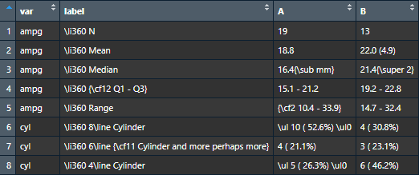
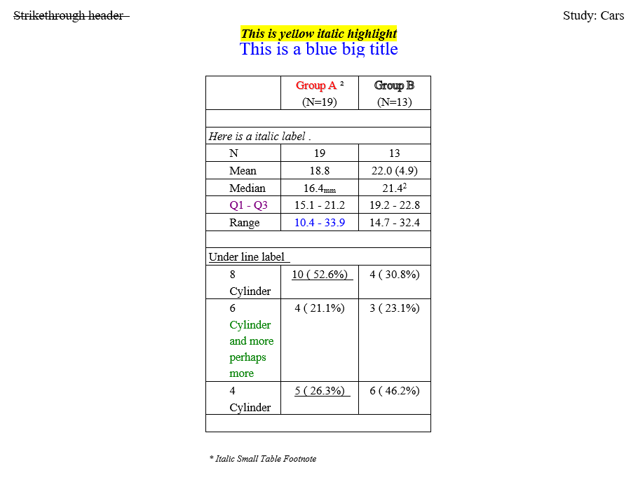

```{r setup, include = FALSE}
knitr::opts_chunk$set(
  collapse = TRUE,
  comment = "#>"
)
```
The **reporter** package allows users to insert code directly with 
`report_options(allow_code = TRUE)`. This feature is currently available only
for RTF output. 

## Insert Code

The **reporter** package let's you insert code in data sets, titles,
footnotes, headers, and footers.

Let's prepare a data set with RTF code:
```{r eval=FALSE, echo=TRUE}
df <- read.table(header = TRUE, text = '
      var     label        A             B
      "ampg"   "\\li360 N"          "19"          "13"
      "ampg"   "\\li360 Mean"       "18.8"  "22.0 (4.9)"
      "ampg"   "\\li360 Median"     "16.4{\\sub mm}"        "21.4{\\super 2}"
      "ampg"   "\\li360 {\\cf12 Q1 - Q3}"    "15.1 - 21.2" "19.2 - 22.8"
      "ampg"   "\\li360 Range"      "{\\cf2 10.4 - 33.9}" "14.7 - 32.4"
      "cyl"    "\\li360 8\\line Cylinder" "\\ul 10 ( 52.6%) \\ul0" "4 ( 30.8%)"
      "cyl"    "\\li360 6\\line {\\cf11 Cylinder and more perhaps more}" "4 ( 21.1%)"  "3 ( 23.1%)"
      "cyl"    "\\li360 4\\line Cylinder" "\\ul 5 ( 26.3%) \\ul0"  "6 ( 46.2%)"')

```



Observe that there are several RTF formatting codes in the data set:

* Indentation with `\\li`
* Subscript and Superscript with `\\sub` and `\\super`
* Coloring with `\\cf`
* Underline with `\\ul`

Now let's do some more manipulation of the RTF in the **reporter** code:
```{r eval=FALSE, echo=TRUE}
fp <- file.path(tempdir(), "example17.rtf")

# Create table
tbl <- create_table(df, first_row_blank = TRUE, borders = c("all")) |>
  stub(c("var", "label"), width = .8) |>
  define(var, blank_after = TRUE, label_row = TRUE,
         format = c(ampg = "\\i Here is a italic label \\i0.", 
                    cyl = "\\ul Under line label \\ul0")) |>
  define(A, label = "\\shad {{\\cf6 Group A}} {common::supsc('2')}\\shad0", align = "center", n = 19) |>
  define(B, label = "\\outl Group B \\outl0", align = "center", n = 13) |>
  footnotes("\\i\\fs14 * Italic Small Table Footnote \\fs18")

# Create report and add content
rpt <- create_report(fp, orientation = "portrait", output_type = "RTF",
                     font = "Times") |>
  report_options(allow_code = TRUE) |>
  page_header(left = "\\strike Strikethrough header \\strike0", right = "Study: Cars") |>
  titles("\\b\\i {{\\highlight7 This is yellow italic highlight}} \\b0\\i0", 
         "\\fs0\\fs28 {{\\cf2 This is a blue big title}} \\fs18") |>
  add_content(tbl) |>
  footnotes("\\i\\fs14 * Italic Small Report Footnote \\fs18") |>
  page_footer(left = "Left",
              center = "Confidential",
              right = "Page [pg] of [tpg]")

```

Note that in the **reporter** package, curly braces are normally reserved
for the glue replacement feature.  Therefore, if you want to use curly braces
as part of your RTF code insertion, they must be doubled, i.e.`{{\\cf6 Group A}}`. 
The single curly braces will still be available as glue replacements.

Here is the result:



As seen above, all the RTF code insertion worked as expected:

* Header is formatted with strike through.
* Titles are formatted with yellow highlight, italic, bold, blue color, and bigger font size.
* Column labels are formatted with red, shadow, and outline.
* Row labels are formatted with italic and underline.
* Subscript and superscript are displayed.
* Data values are formatted with blue, purple, underline, and indentation.
* Footnotes are formatted with italic and smaller font size.

## RTF Color Table

The above example contains several references to the RTF color table.
Here is the complete color table: 

* `\cf1`  : Black
* `\cf2`  : Blue
* `\cf3`  : Cyan
* `\cf4`  : Lime Green
* `\cf5`  : Magenta
* `\cf6`  : Red
* `\cf7`  : Yellow
* `\cf8`  : White
* `\cf9`  : Navy Blue
* `\cf10` : Teal
* `\cf11` : Green
* `\cf12` : Purple
* `\cf13` : Maroon/ Dark Red
* `\cf14` : Olive
* `\cf15` : Gray
* `\cf16` : Light Gray

The above color references are the same as those used by SAS ODS RTF.

Next: [Example 18: Report Options](reporter-report_options.html)
