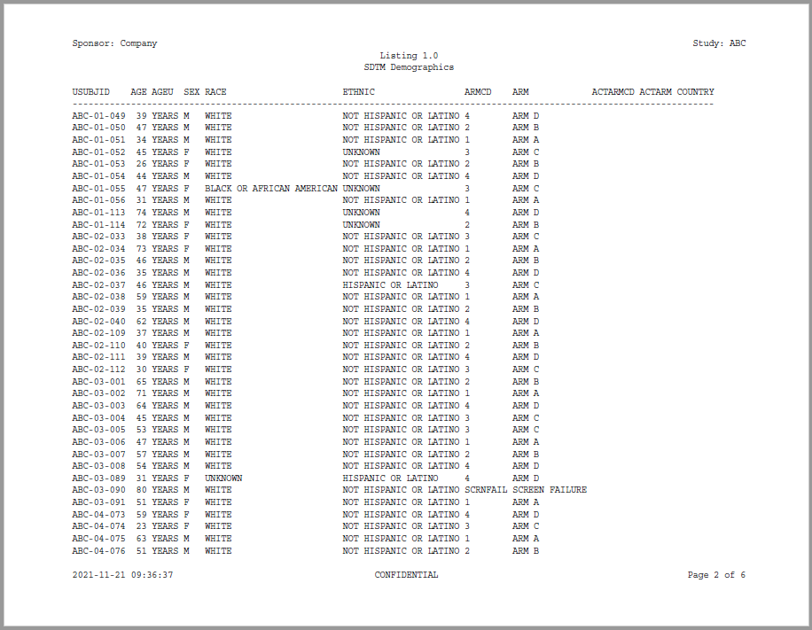
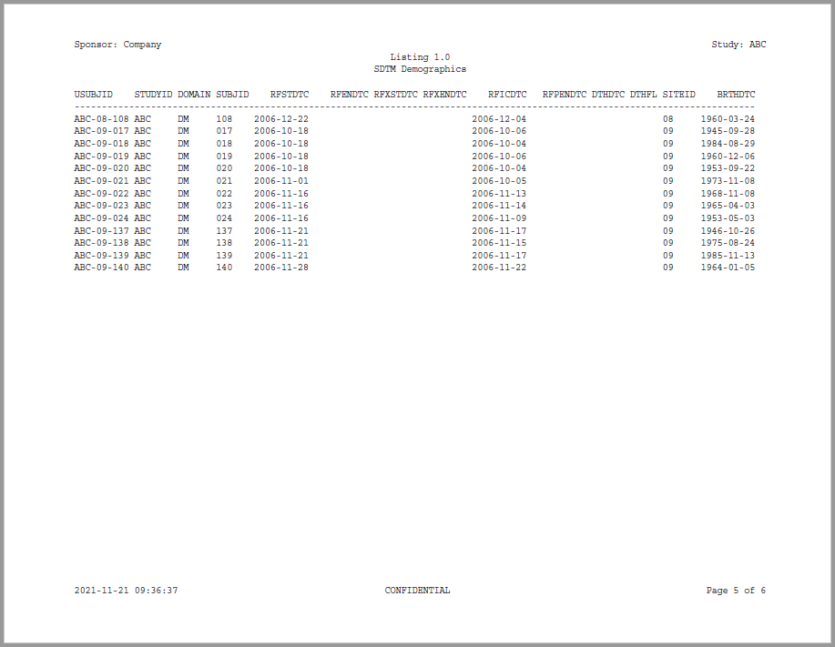
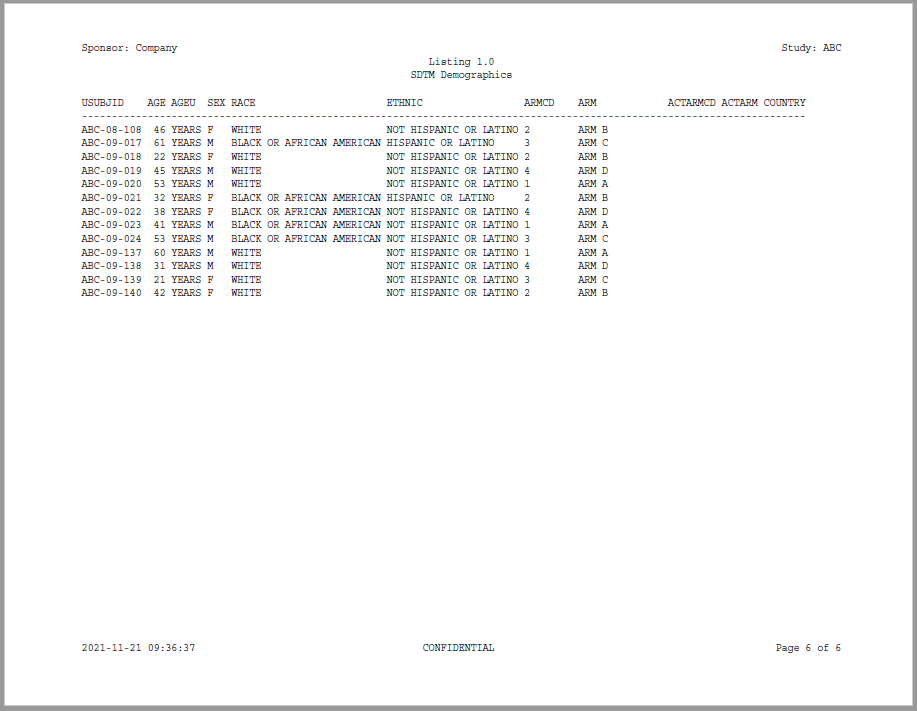

```{r setup, include = FALSE}
knitr::opts_chunk$set(
  collapse = TRUE,
  comment = "#>"
)

options(rmarkdown.html_vignette.check_title = FALSE)

```
## Program

The previous examples in the **reporter** documentation were intentionally
simplified to focus on the workings of a particular function.  It is helpful,
however, to also view **reporter** functions in the context of a complete 
program.  The following example shows a complete program.  The example illustrates
how **reporter** functions work together, and interact with 
**sassy** functions to create a listing.  

The data for this example has been included in the **reporter** package as an
external data file.  It may be accessed using the `system.file()` function
as shown below, or downloaded directly from the **reporter** GitHub site 
[here](https://raw.githubusercontent.com/dbosak01/reporter/master/inst/extdata/DM.csv)

```{r eval=FALSE, echo=TRUE}
library(sassy)
library(magrittr)

options("logr.autolog" = TRUE, 
        "logr.notes" = FALSE)

# Get temp location for log and report output
tmp <- tempdir()

# Open log
lf <- log_open(file.path(tmp, "example1.log"))

# Get Data ----------------------------------------------------------------
sep("Get Data")

# Get path to sample data
pkg <- system.file("extdata", package = "reporter")

# Define data library
libname(sdtm, pkg, "csv") 

# Load library into workspace
lib_load(sdtm) 

# Write Report ------------------------------------------------------------
sep("Write Report")

# Define table object
tbl <- create_table(sdtm.DM) %>% 
  define(USUBJID, id_var = TRUE)


# Define report object
rpt <- create_report(file.path(tmp, "output/example1.pdf"), output_type = "PDF") %>% 
  page_header("Sponsor: Company", "Study: ABC") %>% 
  titles("Listing 1.0", "SDTM Demographics") %>% 
  add_content(tbl, align = "left") %>% 
  page_footer(Sys.time(), "CONFIDENTIAL", "Page [pg] of [tpg]")

# Write report to file system
res <- write_report(rpt) 


# Clean Up ----------------------------------------------------------------
sep("Clean Up")

# Unload data
lib_unload(sdtm)

# Close log
log_close()

# View log
writeLines(readLines(lf, encoding = "UTF-8"))

# View report
# file.show(res$modified_path)

```

## Log

The above program produces the following log:
```
=========================================================================
Log Path: C:/Users/dbosa/AppData/Local/Temp/RtmpgrpGQ1/log/example1.log
Program Path: C:\packages\Testing\reporter_example1.R
Working Directory: C:/packages/Testing
User Name: dbosa
R Version: 4.1.2 (2021-11-01)
Machine: SOCRATES x86-64
Operating System: Windows 10 x64 build 19041
Base Packages: stats graphics grDevices utils datasets methods base
Other Packages: tidylog_1.0.2 magrittr_2.0.1 reporter_1.2.6 libr_1.2.1 fmtr_1.5.4
                logr_1.2.7 sassy_1.0.5 
Log Start Time: 2021-11-21 09:36:31
=========================================================================

=========================================================================
Get Data
=========================================================================

# library 'sdtm': 1 items
- attributes: csv not loaded
- path: C:/Users/dbosa/Documents/R/win-library/4.1/logr/extdata
- items:
  Name Extension Rows Cols    Size
1   DM       csv   87   24 45.4 Kb
         LastModified
1 2021-11-16 10:34:25

lib_load: library 'sdtm' loaded

=========================================================================
Write Report
=========================================================================

# A report specification: 6 pages
- file_path: 'C:\Users\dbosa\AppData\Local\Temp\RtmpgrpGQ1/output/example1.pdf'
- output_type: PDF
- units: inches
- orientation: landscape
- margins: top 0.5 bottom 0.5 left 1 right 1
- line size/count: 127/45
- page_header: left=Sponsor: Company right=Study: ABC
- title 1: 'Listing 1.0'
- title 2: 'SDTM Demographics'
- page_footer: left=2021-11-21 09:36:37 center=CONFIDENTIAL right=Page [pg] of [tpg]
- content: 
# A table specification:
- data: tibble 'sdtm.DM' 87 rows 24 cols
- show_cols: all
- use_attributes: all
- define: USUBJID id_var='TRUE' 

=========================================================================
Clean Up
=========================================================================

lib_sync: synchronized data in library 'sdtm'

lib_unload: library 'sdtm' unloaded

=========================================================================
Log End Time: 2021-11-21 09:36:42
Log Elapsed Time: 0 00:00:10
=========================================================================
```

## Output

Here is the listing produced by the sample program above:








Next: [Complete Example 2](reporter-example2.html)
