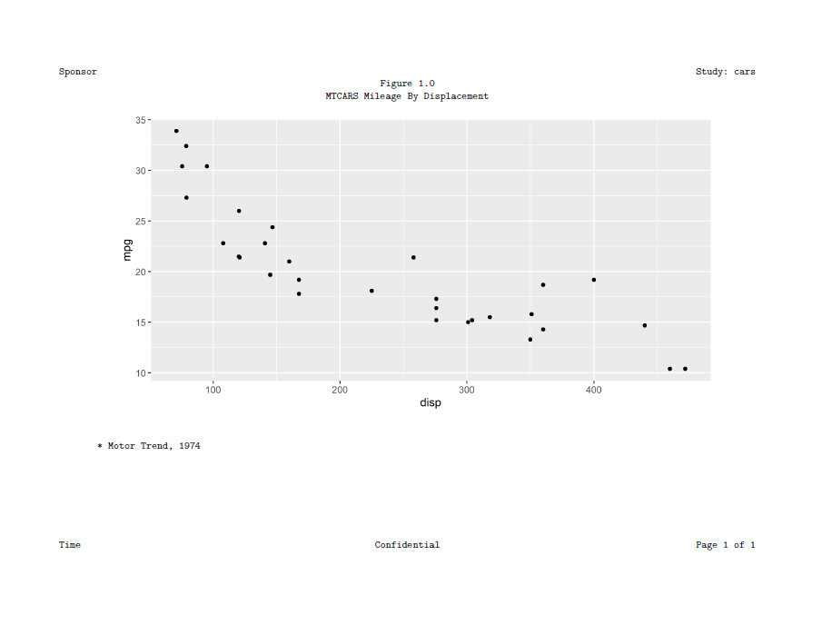

```{r setup, include = FALSE}
knitr::opts_chunk$set(
  collapse = TRUE,
  comment = "#>"
)
```

### Create a Report with a Figure

RTF, PDF, and HTML also support plots produced with the ggplot2 package.  Use 
the `create_plot()` function to create plot content for a report.  The 
plot can be added to the report with the `add_content()` function, just
like tables and text.

```{r eval=FALSE, echo=TRUE} 
library(reporter)
library(ggplot2)
  
# Create temporary path
tmp <- file.path(tempdir(), "example10.pdf")
  
# Prepare data
dat <- mtcars[order(mtcars$cyl), ]

# Generate plot
p <- ggplot(dat, aes(x=disp, y=mpg)) + geom_point()

# Define plot object
plt <- create_plot(p, height = 4, width = 8) %>% 
  titles("Figure 1.0", "MTCARS Mileage By Displacement", blank_row = "none") %>%
  footnotes("* Motor Trend, 1974")

# Add plot to report
rpt <- create_report(tmp, output_type = "PDF") %>%
  set_margins(top = 1, bottom = 1) %>%
  options_fixed(font_size = 12) %>% 
  page_header("Sponsor", "Study: cars") %>%
  add_content(plt) %>%
  page_footer(Sys.time(), "Confidential", "Page [pg] of [tpg]")

# Write out report
res <- write_report(rpt)


# View report
# file.show(tmp)
```


