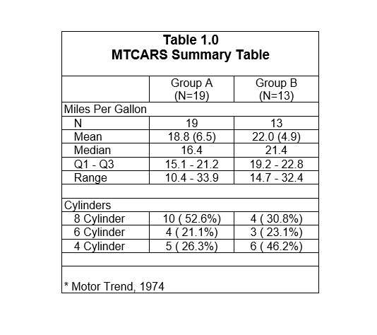

```{r setup, include = FALSE}
knitr::opts_chunk$set(
  collapse = TRUE,
  comment = "#>"
)
```

### Specify Fonts and Borders

By default, the **reporter** package will create fixed-width style reports 
in Courier font. The RTF, HTML, and PDF output types support 
two additional fonts: Arial and 
Times New Roman.  These output types also support the ability 
to turn on borders for your content.  To demonstrate, the simple demographics 
table seen previously is reproduced below in Arial font with borders 
around the table, titles, and footnotes.

```{r eval=FALSE, echo=TRUE} 
library(reporter)

# Create temporary path
tmp <- file.path(tempdir(), "example10.rtf")

# Read in prepared data
df <- read.table(header = TRUE, text = '
      var     label        A             B          
      "ampg"   "N"          "19"          "13"         
      "ampg"   "Mean"       "18.8 (6.5)"  "22.0 (4.9)" 
      "ampg"   "Median"     "16.4"        "21.4"       
      "ampg"   "Q1 - Q3"    "15.1 - 21.2" "19.2 - 22.8"
      "ampg"   "Range"      "10.4 - 33.9" "14.7 - 32.4"
      "cyl"    "8 Cylinder" "10 ( 52.6%)" "4 ( 30.8%)" 
      "cyl"    "6 Cylinder" "4 ( 21.1%)"  "3 ( 23.1%)" 
      "cyl"    "4 Cylinder" "5 ( 26.3%)"  "6 ( 46.2%)"')

# Create table
tbl <- create_table(df, first_row_blank = TRUE, borders = "all") %>% 
  stub(c("var", "label")) %>% 
  column_defaults(width = 1.25) %>% 
  define(var, blank_after = TRUE, label_row = TRUE, 
         format = c(ampg = "Miles Per Gallon", cyl = "Cylinders")) %>% 
  define(label, indent = .25) %>% 
  define(A, label = "Group A", align = "center", n = 19) %>% 
  define(B, label = "Group B", align = "center", n = 13)  %>% 
  titles("Table 1.0", "MTCARS Summary Table", borders = "outside",
         bold = TRUE, font_size = 14) %>% 
  footnotes("* Motor Trend, 1974", borders = "outside")

# Create report and add content
rpt <- create_report(tmp, output_type = "RTF", font = "Arial", 
                     font_size = 12) %>% 
  set_margins(top = 1, bottom = 1) %>%
  add_content(tbl)

# Write out report
write_report(rpt)

# View report
# file.show(tmp)

```



Next: [Example 11: Figure](reporter-figure.html)
