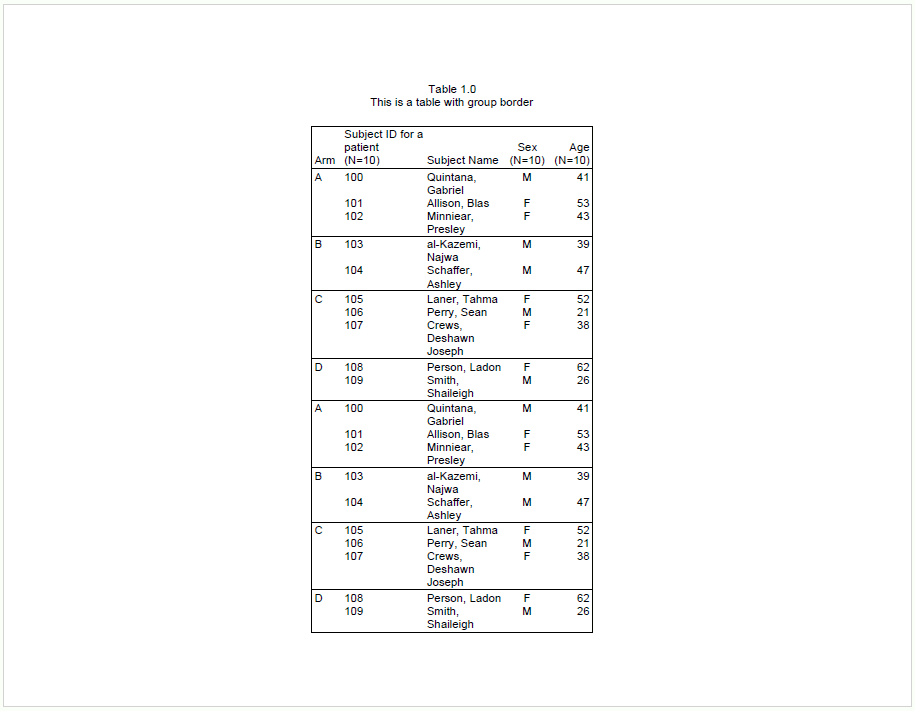
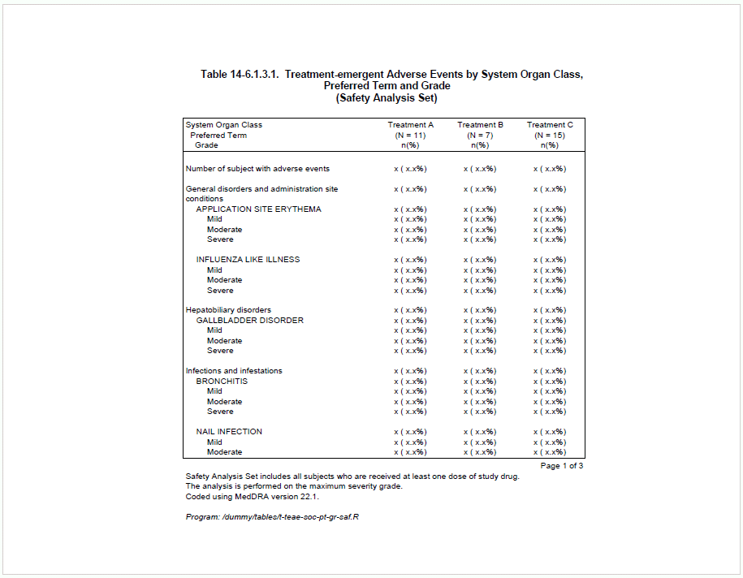
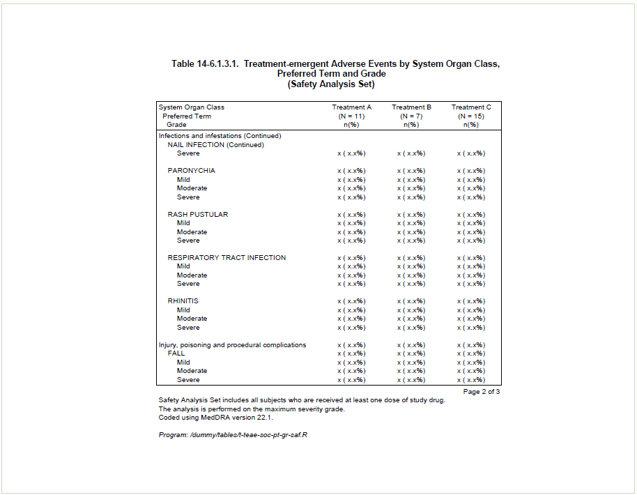
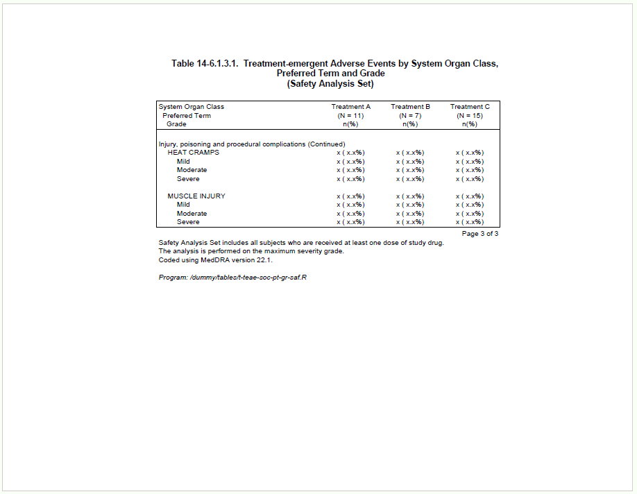
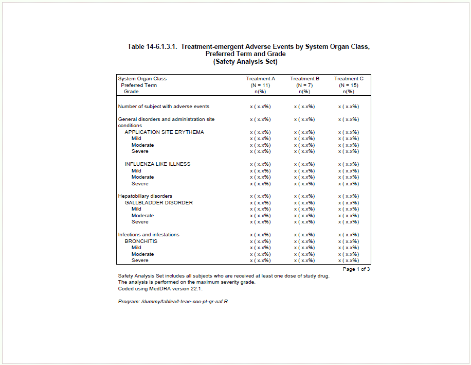
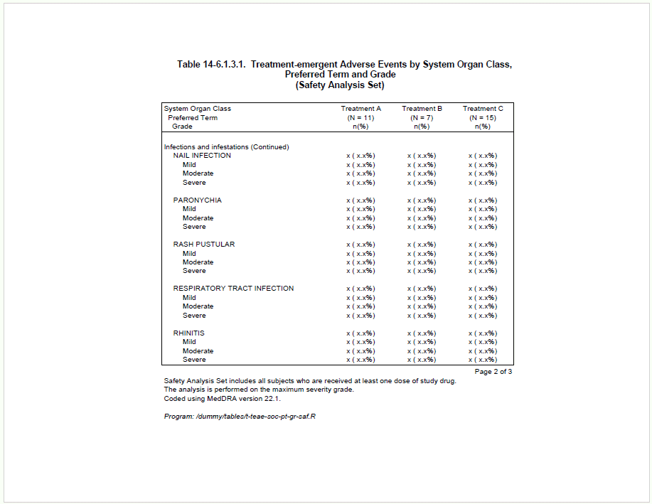
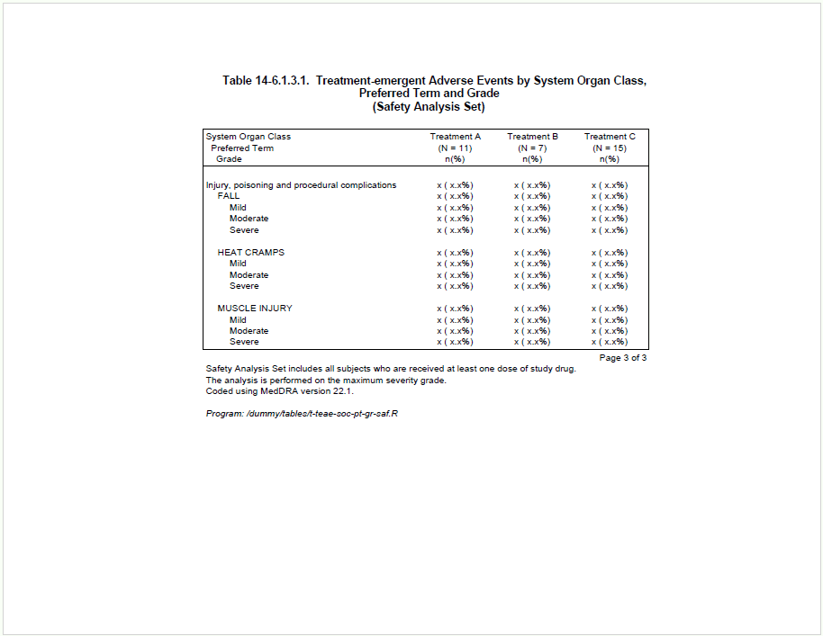
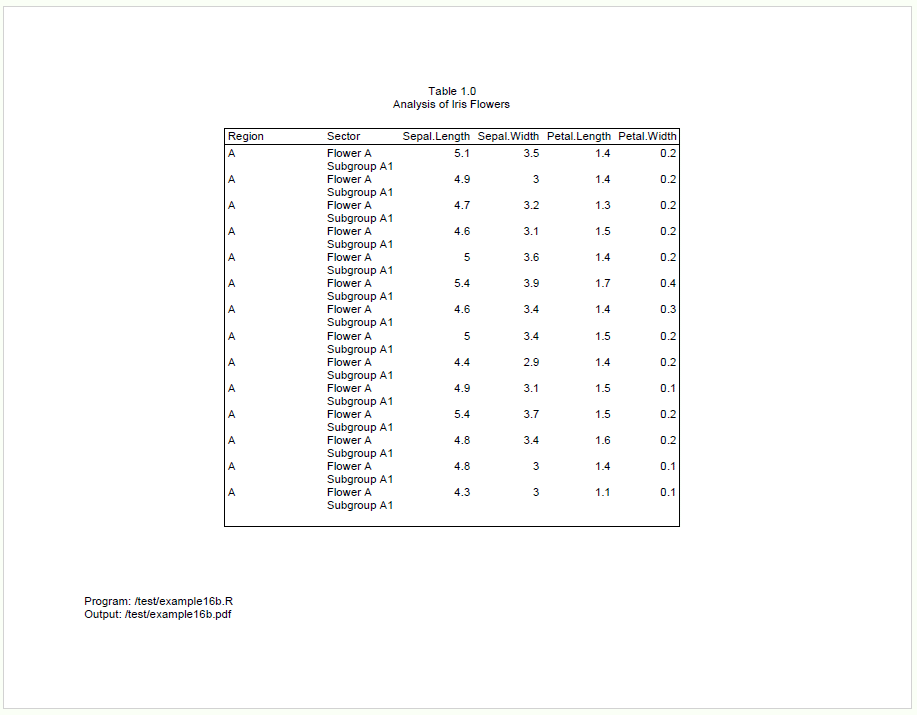
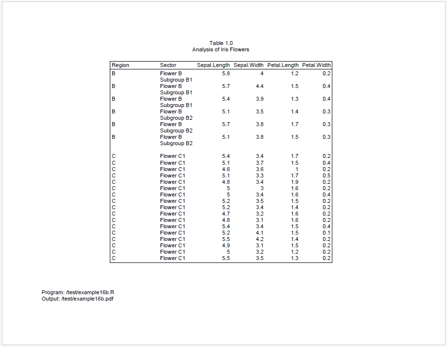
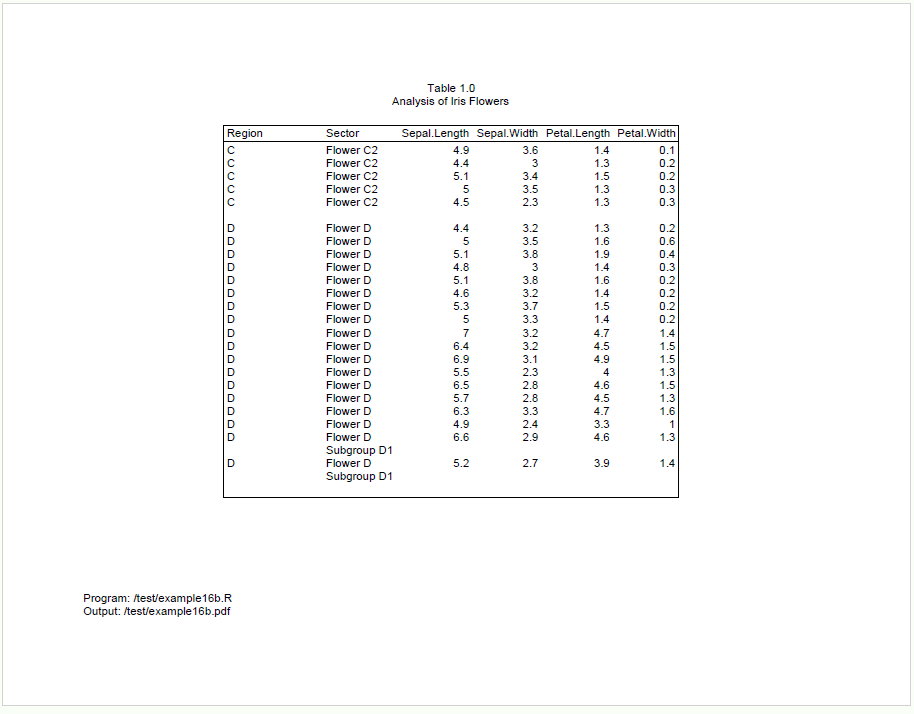

```{r setup, include = FALSE}
knitr::opts_chunk$set(
  collapse = TRUE,
  comment = "#>"
)
```
Data on reports is frequently grouped in some way. The **reporter** package offers 
several features to identify and manage these groups.  Here are some of the 
highlights.

## Group Border

The **reporter** package can draw border lines to separate different groups.
To create the border line, set `group_border = TRUE` on the `define()` function.

Here is an example:
```{r eval=FALSE, echo=TRUE}
library(reporter)

# Create temp file name
tmp <- file.path(tempdir(), "example16a.pdf")

# Create data
arm <- c(rep("A", 3), rep("B", 2), rep("C", 3), rep("D", 2))
subjid <- 100:109
name <- c("Quintana, Gabriel", "Allison, Blas", "Minniear, Presley",
          "al-Kazemi, Najwa", "Schaffer, Ashley", "Laner, Tahma",
          "Perry, Sean", "Crews, Deshawn Joseph", "Person, Ladon",
          "Smith, Shaileigh")
sex <- c("M", "F", "F", "M", "M", "F", "M", "F", "F", "M")
age <- c(41, 53, 43, 39, 47, 52, 21, 38, 62, 26)

df <- data.frame(arm, subjid, name, sex, age, stringsAsFactors = FALSE)
df <- rbind(df, df, df, df)

# Output with group_border
tbl1 <- create_table(df, first_row_blank = FALSE, borders = "outside") %>%
  define(subjid, label = "Subject ID for a patient", n = 10, align = "left",
         width = 1) %>%
  define(name, label = "Subject Name", width = 1) %>%
  define(sex, label = "Sex", n = 10, align = "center") %>%
  define(age, label = "Age", n = 10) %>%
  define(arm, label = "Arm",
         dedupe = TRUE,
         group_border = TRUE) 


rpt <- create_report(tmp, output_type = "pdf", font = "Arial",
                     font_size = 10) %>%
  titles(c("Table 1.0", "This is a table with group border"), align = "center") %>%
  add_content(tbl1) %>%
  set_margins(top = 1, bottom = 1)


res <- write_report(rpt)

```




## Break Label

For some types of reports,
it is desirable to have a label that indicates when a group has been broken across
pages. This feature is supported with the "break_label" parameter
on the `define()` function.  In the example below, the "break_label" is assigned
a value of "(Continued)":

```{r eval=FALSE, echo=TRUE} 
library(reporter)

fp <- file.path(tempdir(), "example16b.pdf")

# Prepare data
adae <- data.frame(
  total = rep("Number of subject with adverse events", 53),
  AESOC = c(NA, 
            rep("General disorders and administration site conditions", 9),
            rep("Hepatobiliary disorders", 5),
            rep("Infections and infestations", 25),
            rep("Injury, poisoning and procedural complications", 13)),
  AEDECOD = c(NA,
              NA, rep("APPLICATION SITE ERYTHEMA", 4), rep("INFLUENZA LIKE ILLNESS", 4),
              NA, rep("GALLBLADDER DISORDER", 4),
              NA, rep("BRONCHITIS", 4), rep("NAIL INFECTION", 4), rep("PARONYCHIA", 4),
              rep("RASH PUSTULAR", 4), rep("RESPIRATORY TRACT INFECTION", 4),
              rep("RHINITIS", 4),
              NA, rep("FALL", 4), rep("HEAT CRAMPS", 4), rep("MUSCLE INJURY", 4)
  )
)

adae$aedecod_seq <- rep(NA, nrow(adae))
non_na_idx <- !is.na(adae$AEDECOD)
adae$aedecod_seq[non_na_idx] <- ave(adae$AEDECOD[non_na_idx], adae$AEDECOD[non_na_idx], FUN = seq_along)

adae$AESEV <- adae$aedecod_seq
adae$AESEV[adae$AESEV == "1"] <- NA
adae$AESEV[adae$AESEV == "2"] <- "Mild"
adae$AESEV[adae$AESEV == "3"] <- "Moderate"
adae$AESEV[adae$AESEV == "4"] <- "Severe"

adae$trt1 <- "x ( x.x%)"
adae$trt2 <- "x ( x.x%)"
adae$trt3 <- "x ( x.x%)"

adae$aedecod_id <- rep(NA, nrow(adae))
adae$aedecod_id[non_na_idx] <- ave(adae$AEDECOD[non_na_idx], adae$AESOC[non_na_idx],
                                   FUN = function(x){as.numeric(factor(x, levels = unique(x)))})

adae$blank_grp <- paste(adae$total, 
                        adae$AESOC, 
                        ifelse(adae$aedecod_id == 1,NA,adae$AEDECOD), 
                        sep = "|")

adae <- adae[, setdiff(names(adae), c("aedecod_seq", "aedecod_id"))]

# Output
custom_n_format <- function(x){
  return(paste0("\n(N = ",x,")\nn(%)"))
}

current_date <- gsub(" ","",toupper(format(Sys.Date(),"%d %b %Y")))
current_time <- substr(Sys.time(),12,19)
output_name <- "example16c.pdf"
program_path <- "/dummy/tables/t-teae-soc-pt-gr-saf.R"

total_width <- 6
trt_width <- 1.04
item_width <- total_width - (trt_width*3)

tbl <- create_table(adae, 
                    borders = "outside",
                    n_format = custom_n_format) %>%
  
  # ----- Column setting -----#
  column_defaults(from = trt1, to = trt3, align = "center", width = trt_width) %>%
  define(blank_grp, blank_before = T, visible = FALSE) %>%
  stub(vars = c("total", "AESOC", "AEDECOD", "AESEV"), 
       label = "System Organ Class\n  Preferred Term\n    Grade", 
       width = item_width) %>%
  define(AESOC, break_label = "(Continued)") %>%
  define(AEDECOD, indent = 0.16, break_label = "(Continued)") %>%
  define(AESEV, indent = 0.32) %>%
  define(trt1, label = "Treatment A", n=11) %>%
  define(trt2, label = "Treatment B", n=7) %>%
  define(trt3, label = "Treatment C", n=15) %>%
  
  # ----- Footnote setting -----#
  footnotes("Page [pg] of [tpg]", align = "right", blank_row = "none", valign = "top") %>%
  footnotes("Safety Analysis Set includes all subjects who are received at least one dose of study drug.",
            align = "left", blank_row = "none", valign = "top") %>%
  footnotes("The analysis is performed on the maximum severity grade.",
            align = "left", blank_row = "none", valign = "top") %>%
  footnotes("Coded using MedDRA version 22.1.",
            align = "left", blank_row = "none", valign = "top") %>%
  footnotes(paste0("Program: ", program_path), italics = TRUE) 

sty <- create_style(font_name = "Arial",
                    font_size = 9)

rpt <- create_report(fp, 
                     orientation = "landscape", 
                     output_type = "PDF")  %>%
  add_style(style = sty) %>%
  set_margins(top = 1, bottom = 0.75, right = 1, left = 1.5) %>%
  add_content(tbl) %>%
  
  # ----- Title setting -----#
  titles("Table 14-6.1.3.1.  Treatment-emergent Adverse Events by System Organ Class,",
         "Preferred Term and Grade",
         "(Safety Analysis Set)",
         bold = T,
         font_size = 11) 

# Write the report
res <- write_report(rpt)

# Uncomment to view
# file.show(res$path)

```




<br>




<br>


## Group Cohesion

You many also want to avoid splitting groups 
across pages altogether. To keep groups together on the same page, 
you can use the "group_cohesion" parameter on the `define()` function. 

To illustrate, we will make a small modification to the code above to turn on
group cohesion:
```{r eval=FALSE, echo=TRUE} 
define(AESOC, break_label = "(Continued)", group_cohesion = TRUE)
define(AEDECOD, indent = 0.16, break_label = "(Continued)", group_cohesion = TRUE)
```
Now the result is as follows:



<br>



<br>



<br>

With the above modification, the SOC group *"Infections and infestations"* is 
still split in default setting because it is a large group, but the preferred term 
*"NAIL INFECTION"* is not split. However, the other SOC breaks have all been 
avoided by moving groups to the next page.  In this way, the report looks nicer and 
becomes more readable.

## Multiple Group Cohesion

The group cohesion feature also works with multiple columns.  To illustrate, 
let's look at another example: 

```{r eval=FALSE, echo=TRUE} 
library(reporter)

fp <- file.path(tempdir(), "example16b.pdf")

# Create data
dat <- iris[1:91,]

dat$group_1 <- c(
  rep("A", 14),
  rep("B", 6),
  rep("C", 22),
  rep("D", 18),
  rep("E", 31)
)

dat$group_2 <- c(
  rep("Flower A\nSubgroup A1", 14),
  rep("Flower B\nSubgroup B1", 3),
  rep("Flower B\nSubgroup B2", 3),
  c(rep("Flower C1", 17)),
  c(rep("Flower C2", 5)),
  c(rep("Flower D", 16), rep("Flower D\nSubgroup D1", 2)),
  c(rep("Flower E1", 2)),
  c(rep("Flower E2", 29))
)

dat <- dat[, c("group_1", "group_2", "Sepal.Length", 
               "Sepal.Width", "Petal.Length","Petal.Width")]

# Create table
tbl <- create_table(dat, borders = "outside") %>%
  define(group_1, group_cohesion = TRUE, label = "Region", blank_after = T, 
         width = 1.2) %>%
  define(group_2, group_cohesion = TRUE, label = "Sector")

# Create report
rpt <- create_report(fp, output_type = "pdf", font = "Arial",
                     font_size = 10, orientation = "landscape") %>%
  titles("Table 1.0", "Analysis of Iris Flowers") %>%
  set_margins(top = 1, bottom = 1) %>%
  add_content(tbl) %>%
  footnotes("Program: /test/example16b.R", 
            "Output: /test/example16b.pdf")

# Output report
res <- write_report(rpt)

```



<br>



<br>



<br>

We can see above that there is still space at the end of page 1, but it's not enough
for all of region B. To keep region B together, it is therefore moved to 
page 2.

After region B moves to page 2, the remaining space is not enough for all of region C.
And we cannot move all of region C to page 3, because it is too big. 

As a result, region C will be split between pages 2 and 3. However, because we
engaged group cohesion for both Region and Sector,
**reporter** will try to keep the sectors on the same page. Therefore, all
of sector "Flower C2" is moved to page 3.

#### Logic of Group Cohesion

The logic of group cohesion is very simple. If a group is to be split, the 
group will be moved to next page only if the current page is at least 80% full.
Accordingly, Region B moves to the next page because Region A occupies at least 80% 
of the page. Similarly, Sector C2 moves to the next page because the combined data 
from Region B and Sector C1 reaches the 80% threshold.

When `group_cohesion = TRUE`, the default strength of group cohesion is 0.2, 
which means the required proportion is `1 - 0.2 = 0.8`. Users can change the 
required proportion by assigning more strength, such as `group_cohesion = 0.6`, 
which means the requirement of proportion is 0.4. Once the previous group has reached 
40% of page, the next group can be moved to a new page if the remaining space is not enough.
That is to say, the stronger the group cohesion, the lower the required proportion,
and the less likely the group is to split.

Next: [More Examples](reporter-more.html)
