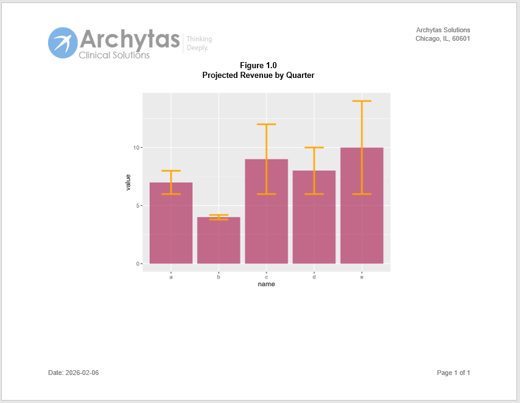

```{r setup, include = FALSE}
knitr::opts_chunk$set(
  collapse = TRUE,
  comment = "#>"
)
```

### Create a Report with a Header or Footer Image

The `header_image()` and `footer_image()` functions allow you to insert an image
into the report page header or footer.  These functions are useful if you want to
put a company logo or other identifying graphic into the page header or footer.

To add an image to a report header, first define the header using the 
`page_header()` function. For the column you want to insert the image, 
leave the text blank.  Then use the "align" parameter of the `header_image()`
function to insert the image into the desired column. 

Here is an example:

```{r eval=FALSE, echo=TRUE} 
library(reporter)
library(ggplot2)

# Get image path
dir <- system.file("extdata", package = "reporter")
ipth <- file.path(dir, "Logo_full.png")

# create dummy data
data <- data.frame(
  name=letters[1:5],
  value=sample(seq(4,15),5),
  sd=c(1,0.2,3,2,4)
)

# Define Revenue Plot
p <- ggplot(data) +
  geom_bar( aes(x=name, y=value), stat="identity", fill="maroon", alpha=0.7) +
  geom_errorbar( aes(x=name, ymin=value-sd, ymax=value+sd), width=0.4, colour="orange",
                 alpha=0.9, linewidth=1.3)


# Create plot object
plt <- create_plot(p, height = 4.5, width = 6) |>
  titles("Figure 1.0", "Projected Revenue by Quarter", bold = TRUE, font_size = 12)

# Create report
rpt <- create_report("./output/myreport.docx", output_type = "DOCX",
                     font = "Arial", font_size = 10) |>
  page_header("",                          # Put nothing in left column
    c("Archytas Solutions\nChicago, IL, 60601"), # Combine right column text into same cell
              width = c(6, 0, 3)) |>       # Remove middle cell with zero width
  header_image(ipth,                       # Assign image file path
               height = .75, width = 3.5,  # Set height and width
               align = "left") |>          # Align to left header column
  add_content(plt) |>
  page_footer(paste0("Date: ", Sys.Date()), right = "Page [pg] of [tpg]")

# Write report to file
res <- write_report(rpt)

# View report
# file.show(res$path)

```

And here is the generated report:



Next: [More Examples](reporter-more.html)
