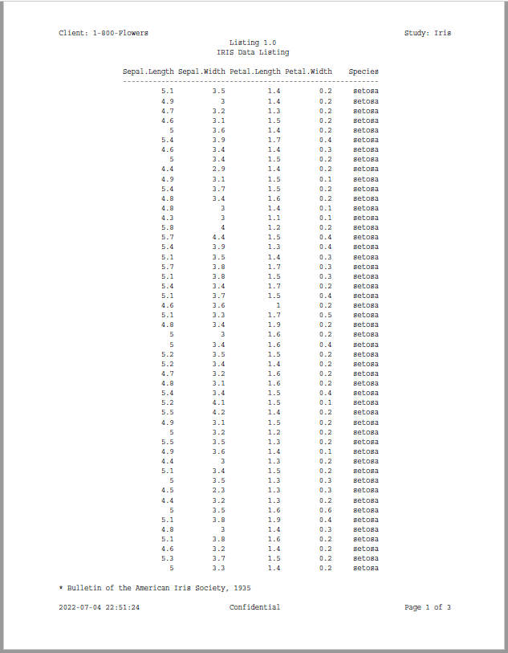

```{r setup, include = FALSE}
knitr::opts_chunk$set(
  collapse = TRUE,
  comment = "#>"
)
```

### Create a Simple Listing

Here is an example of 
a regulatory-style listing using **reporter** and the iris sample data frame.
Notice how the `write_report()` function breaks the page automatically
and appropriately:

```{r eval=FALSE, echo=TRUE} 
library(reporter)

# Create temp file name
tmp <- file.path(tempdir(), "example1.pdf")

# Create the report
rpt <- create_report(tmp, orientation = "portrait", output_type = "PDF") %>% 
  page_header(left = "Client: 1-800-Flowers", right = "Study: Iris") %>% 
  titles("Listing 1.0", "IRIS Data Listing") %>% 
  add_content(create_table(iris)) %>% 
  footnotes("* Bulletin of the American Iris Society, 1935") %>%
  page_footer(left = Sys.time(), 
              center = "Confidential", 
              right = "Page [pg] of [tpg]")

# Write the report
write_report(rpt)

# file.show(tmp)

```



Next: [Example 2: Table](reporter-table.html)
