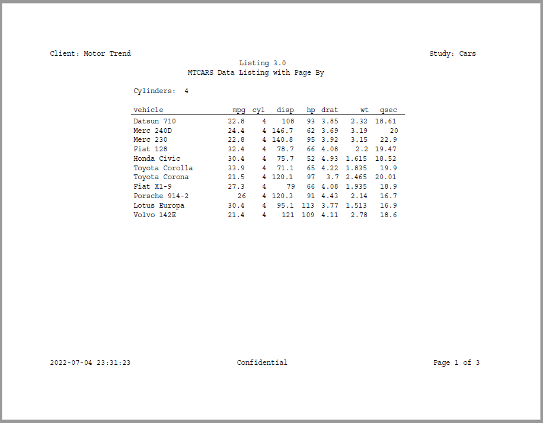
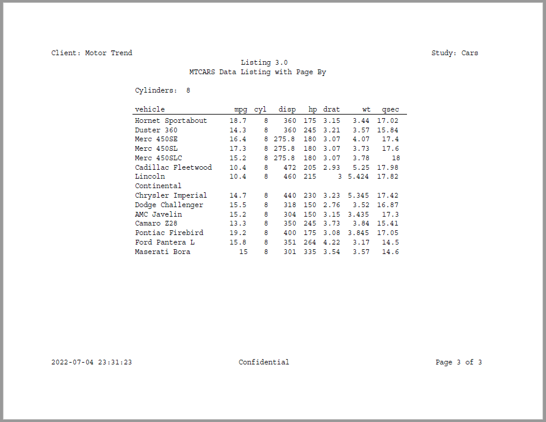

```{r setup, include = FALSE}
knitr::opts_chunk$set(
  collapse = TRUE,
  comment = "#>"
)
```

### Create a Table with a By-Group

A page by variable will split the report into pages by a variable, and
label each page according the variable value.  The page by can be assigned to
the report, to a table, or to a plot.  The page by label will appear between
the titles and the content body.  It can be aligned left, right, or center.
The data should be sorted by the page by variable prior to reporting.

```{r eval=FALSE, echo=TRUE}  
library(reporter)

# Create temp file name
tmp <- file.path(tempdir(), "example7.pdf")

# Prepare data
dat <- mtcars[order(mtcars$cyl), ]
dat <- data.frame(vehicle = rownames(dat), dat)

# Define table
tbl <- create_table(dat, show_cols = 1:8) %>% 
  page_by(cyl, label="Cylinders: ") 

# Create the report
rpt <- create_report(tmp, output_type = "PDF", 
                     font = "Courier", font_size = 12) %>% 
  page_header(left = "Client: Motor Trend", right = "Study: Cars") %>% 
  titles("Listing 3.0", "MTCARS Data Listing with Page By") %>% 
  set_margins(top = 1, bottom = 1) %>% 
  add_content(tbl) %>% 
  page_footer(left = Sys.time(), 
          center = "Confidential", 
          right = "Page [pg] of [tpg]")


# Write the report
write_report(rpt)

# file.show(tmp)

```





Next: [Example 8: Title Header](reporter-title_header.html)
