```{r setup, include = FALSE}
knitr::opts_chunk$set(
  collapse = TRUE,
  comment = "#>"
)
```
[Example 17: Code Insertion](reporter-codeinsert.html) discusses the "allow_code" 
parameter in `report_options()`. In this section, we're going to introduce the other 
parameters on `report_options()`.  These parameters allow you to change 
some of the default settings of the **reporter** package.

## Report Options{#top}

* [Auto Pagination](#auto_page)
* [Page Wrapping](#page_wrap)
* [Line Breaks](#line_break)

## Auto Pagination {#auto_page}

Normally, **reporter** will insert a page break automatically when the number of 
lines meets the calculated line count.  The line count is based on the font size,
font type, margins, and page size.

Users can also control pagination by creating a page break variable
and identifying that variable in a define function, such as: 
`define(page_break = TRUE)`.  The rendering procedure will then insert a page break
every time the page variable changes.  

Observe that the rendering procedure will still insert a page break automatically
if the page variable rows exceed the calculated line count.  That is to say,
the automatic page breaking is still on, even when the user has supplied a page
break variable.

There are times, however, when you may want to turn off the automatic page 
breaking completely, and only break the page when indicated by the page variable.
To disable the automatic page breaking, use the "auto_page" parameter on 
either the `report_options` or `create_table` functions.

* `report_options(auto_page = FALSE)` turns off auto-pagination for all tables in the report.
* `create_table(auto_page = FALSE)` turns off the auto-pagination for a particular table.

Note that if the `create_table` and `report_options` settings conflict, the 
`create_table` value will take precedence.

Let's look at an example:

```{r eval=FALSE, echo=TRUE}
fp <- file.path(tempdir(), "example18a.rtf")

dat <- iris[1:100, ]
dat$Species <- as.character(dat$Species)
dat$Species[1:25] <- rep("setosa1", 25)
dat$Species[26:50] <- rep("setosa2", 25)

tbl <- create_table(dat, auto_page = FALSE) %>%
  footnotes("First Table with auto_page=FALSE in create_table", 
            "My footnote 2", valign = "bottom") %>%
  define(Species, page_break = TRUE)

tbl2 <- create_table(dat) %>%
  footnotes("Second Table with auto_page=FALSE in report_options", 
            "My footnote 2", valign = "bottom") %>%
  define(Species, page_break = TRUE)

tbl3 <- create_table(dat, auto_page = TRUE) %>%
  footnotes("Third Table with auto_page=TRUE in create_table", 
            "My footnote 2", valign = "bottom") %>%
  define(Species, page_break = TRUE)

rpt <- create_report(fp, output_type = "RTF", font = "Arial",
                     font_size = 10, orientation = "landscape") %>%
  report_options(auto_page = FALSE) %>%
  set_margins(top = 1, bottom = 1) %>%
  page_header("Left", c("Right1", "Right2", "Page [pg] of [tpg]"), blank_row = "below") %>%
  titles("Table 1.0", "My Nice Table") %>%
  add_content(tbl) %>%
  add_content(tbl2) %>%
  add_content(tbl3) %>%
  page_footer("Left1", "Center1", "Right1")

res <- write_report(rpt)
```

The above code creates three tables with different settings:

* `tbl1` turns off auto-pagination with `create_table(auto_page = FALSE)`.
* `tbl2` has no setting in `create_table()`, so it follows 
`report_options(auto_page = FALSE)`, which also turns off auto-pagination.
* `tbl3` keeps auto-pagination with `create_table(auto_page = TRUE)` 
regardless of `report_options(auto_page = FALSE)`.

### Result Without Auto-Pagination

`tbl1` and `tbl2` have same results as shown below:


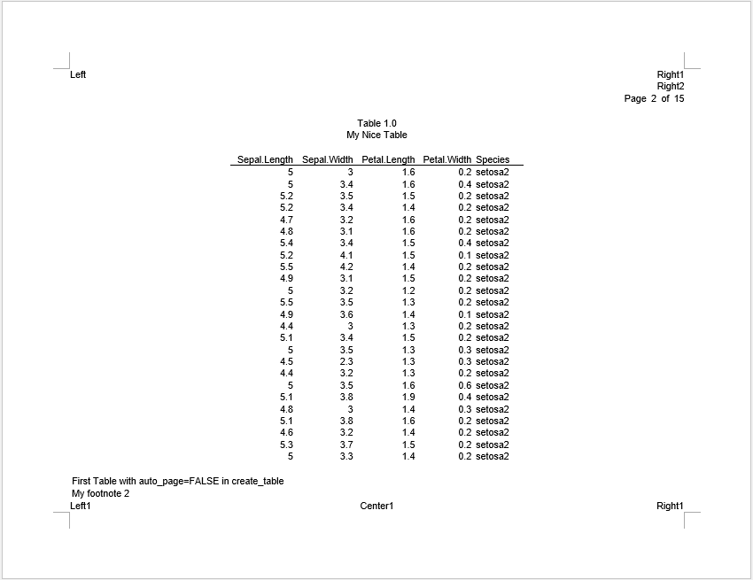

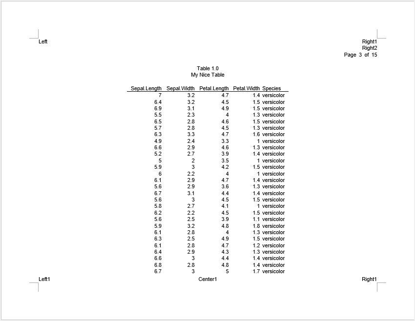

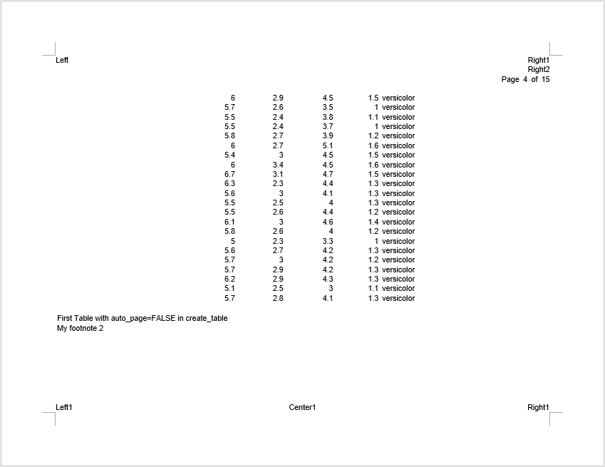

*"setosa1"* and *"setosa2"* fill the pages exactly. 
*"versicolor"* has too many records so there is a page overflow when auto-pagination is
turned off.  You may remedy the page overflow by supplying an additional page break
to the "Species" variable at the desired location.

### Result With Auto-Pagination

`tbl3` keeps auto-pagination. Let's see the difference:


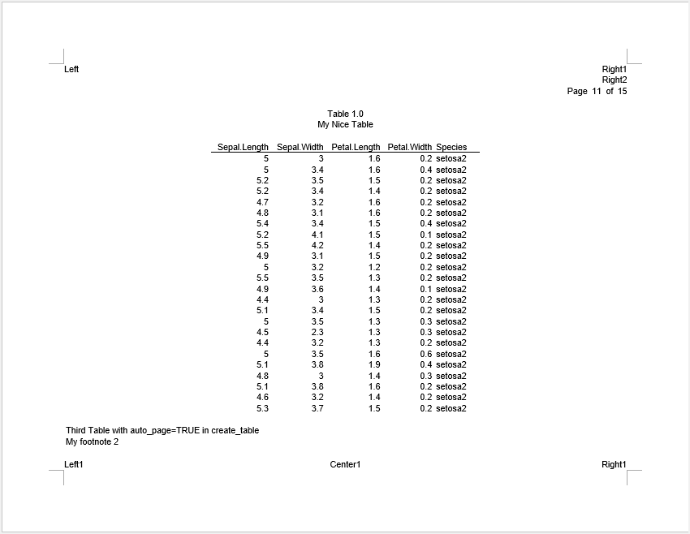

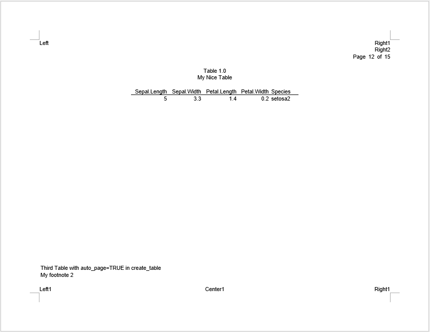

With auto-pagination, the **reporter** package keeps a small buffer to
prevent unexpected overflows. Therefore, *"setosa1"* and *"setosa2"* break across pages
instead of fitting exactly. 

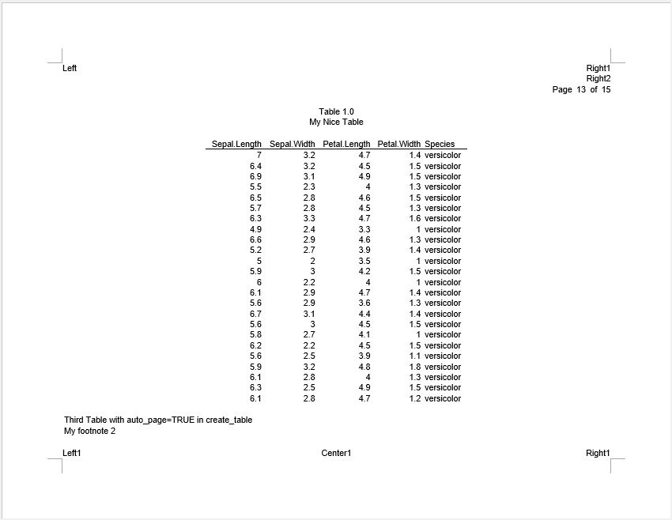

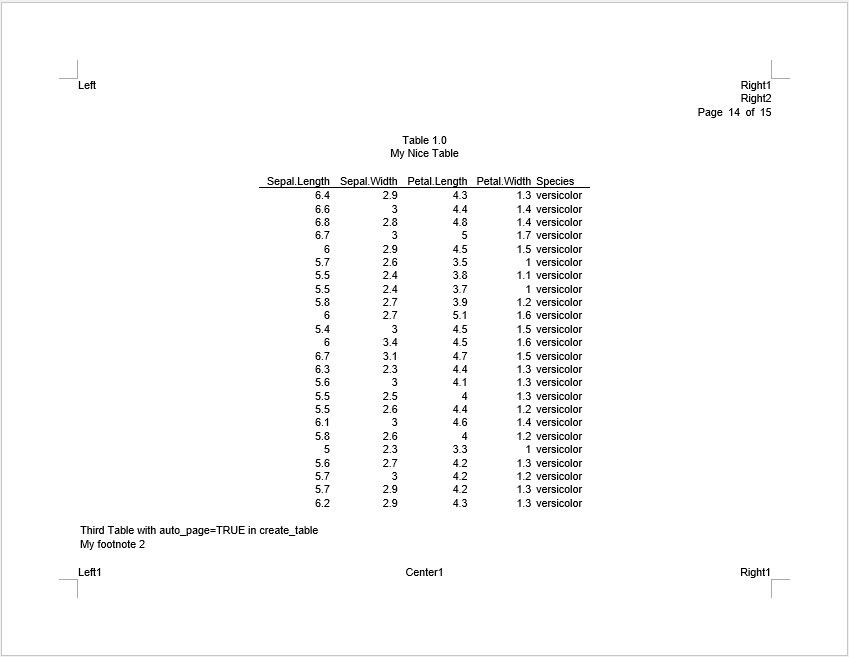

As for *"versicolor"*, the **reporter** package breaks the pages automatically.

That is to say, if you have developed a paging algorithm that intends to utilize
every line on the page, with no buffer, it may be best to turn off the auto-pagination.
Be advised that when turning auto-pagination off, users will be responsible for 
any page overflows.

[top](#top)

## Page Wrapping {#page_wrap}

By default, when there are too many columns to fit on one page, the 
**reporter** package will wrap columns across pages. Users can turn it off with 
`report_options(page_wrap = FALSE)` or `create_table(page_wrap = FALSE)`.  Turning
the feature off will allow you to control page wrapping more precisely. 

Let's look at an example:

```{r eval=FALSE, echo=TRUE}
fp <- file.path(tempdir(), "example18b.rtf")

# Read in prepared data
df <- read.table(header = TRUE, text = '
  USUBJID STUDYID  DOMAIN  SUBJID  RFSTDTC       RFENDTC       RFXSTDTC      RFXENDTC      RFICDTC
  "001"   "ABC"    "DM"    "01"    "2021-12-01"  "2021-12-20"  "2021-12-02"  "2021-12-20"  "2021-12-01"
  "002"   "ABC"    "DM"    "02"    "2021-12-02"  "2021-12-21"  "2021-12-03"  "2021-12-21"  "2021-12-02"
  "003"   "ABC"    "DM"    "03"    "2021-12-03"  "2021-12-22"  "2021-12-04"  "2021-12-22"  "2021-12-03"
  "004"   "ABC"    "DM"    "04"    "2021-12-04"  "2021-12-23"  "2021-12-05"  "2021-12-23"  "2021-12-04"
  "005"   "ABC"    "DM"    "05"    "2021-12-05"  "2021-12-24"  "2021-12-06"  "2021-12-24"  "2021-12-05"
  "006"   "ABC"    "DM"    "06"    "2021-12-06"  "2021-12-25"  "2021-12-07"  "2021-12-25"  "2021-12-06"
  "007"   "ABC"    "DM"    "07"    "2021-12-07"  "2021-12-26"  "2021-12-08"  "2021-12-26"  "2021-12-07"
  "008"   "ABC"    "DM"    "08"    "2021-12-08"  "2021-12-27"  "2021-12-09"  "2021-12-27"  "2021-12-08"')

# Define table
tbl <- create_table(df, page_wrap = FALSE) |>
  titles("page_wrap = FALSE in create_table()")
tbl2 <- create_table(df) |>
  titles("page_wrap = FALSE in report_options()")
tbl3 <- create_table(df, page_wrap = TRUE)

# Define Report
rpt <- create_report(fp, font = "Arial", font_size = 10, units = "cm",
                     orientation = "portrait") %>%
  report_options(page_wrap = FALSE) %>%
  titles("Listing 1.0",
         "Demographics Dataset") %>%
  add_content(tbl, align = "left") %>%
  add_content(tbl2, align = "left") %>%
  add_content(tbl3, align = "left") %>%
  page_header("Sponsor", "Drug") %>%
  page_footer(left = "Time", right = "Page [pg] of [tpg]") %>%
  footnotes("My footnote")

res <- write_report(rpt, output_type = "rtf")
```

In the above example, we created three tables with different settings:

* `tbl1` turns off page wrapping with `create_table(page_wrap = FALSE)`.
* `tbl2` has no setting in `create_table()`, so it follows 
`report_options(page_wrap = FALSE)`, which also turns off page wrapping.
* `tbl3` keeps page wrapping on with `create_table(page_wrap = TRUE)`, 
regardless of the report settings.

### Result Without Page Wrapping

For the first two tables, observe that without page wrapping the columns flow into 
the margins.

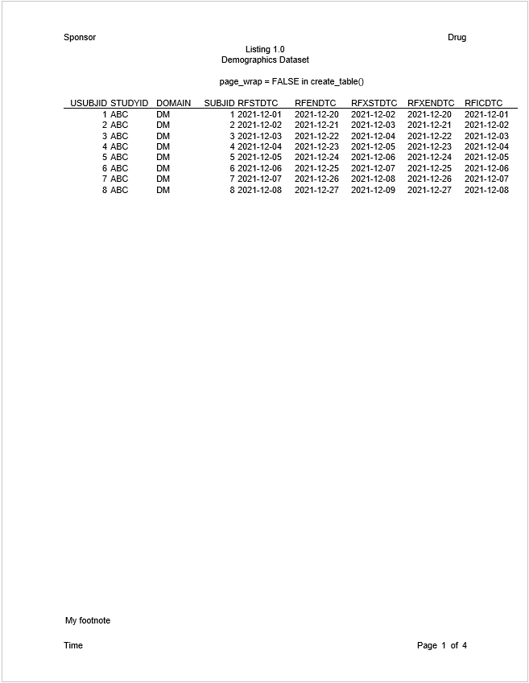

You may fix the column overflow by inserting a page wrap in a `define()` function,
or by turning on "page_wrap".

### Result With Page Wrapping

For `tbl3`, the page is wrapped so some columns are displayed in the next page.

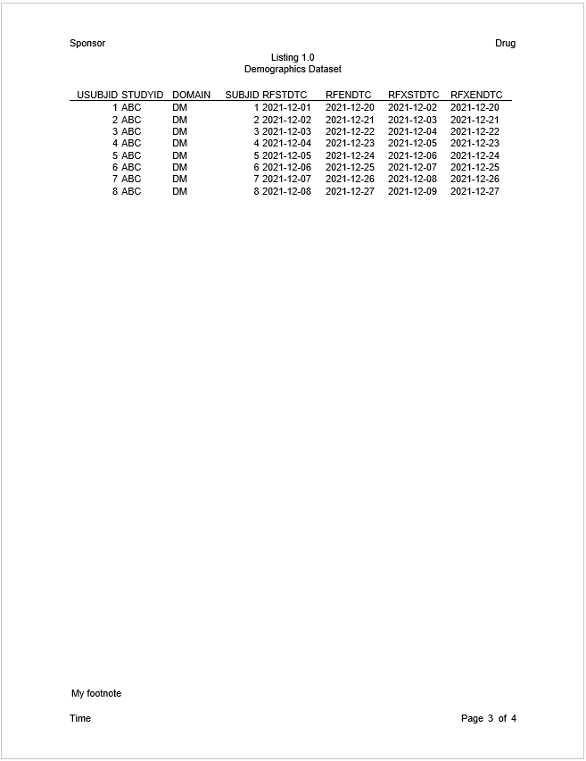

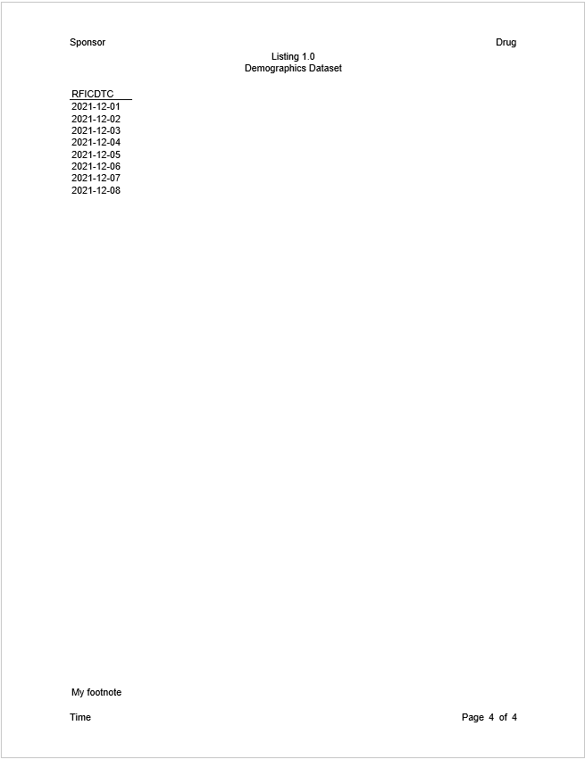

[top](#top)

## Line Breaks {#line_break}

To reduce the chance of page overflows, the **reporter** rendering procedure
places a hard line break character at the end of every line.  In this way,
the number of lines on a page can be accurately counted.  

There may be times, however, when you do not want these hard line breaks. The 
"line_break" parameter allows you to turn them off.  You can turn off the line
breaks with `report_options(line_break = FALSE)`. When line breaks are off, 
line wrapping will be controlled by the editor instead of **reporter**. **reporter**
will nevertheless attempt to count the number of lines as accurately as possible.
**reporter** will also honor any line breaks manually inserted by the user.
This feature is allowed on RTF, DOCX, and HTML file formats.  

Here is an example:

```{r eval=FALSE, echo=TRUE}
fp <- file.path(tempdir(), "example18c.rtf")

df <- read.table(header = TRUE, text = '
  var     label        A             B
  "ampg"   "N"          "19"          "13"
  "ampg"   "Mean"       "18.8 (6.5)"  "22.0 (4.9)"
  "ampg"   "Median"     "16.4"        "21.4"
  "ampg"   "Q1 - Q3"    "15.1 - 21.2" "19.2 - 22.8"
  "ampg"   "Range"      "10.4 - 33.9" "14.7 - 32.4"
  "cyl"    "8 Cylinder" "10 ( 52.6%)" "4 ( 30.8%)"
  "cyl"    "6 Cylinder and more perhaps more" "4 ( 21.1%)"  "3 ( 23.1%)"
  "cyl"    "4 Cylinder" "5 ( 26.3%)"  "6 ( 46.2%)"')

df$sub_title <- "This is a long page by value which would not be inserted any line break characters."

# Create table
tbl <- create_table(df, first_row_blank = TRUE, borders = c("all")) %>%
  stub(c("var", "label"), width = .8) %>%
  page_by(sub_title, label = "This is a long label which would make multiple lines:",
          bold = "label") %>%
  define(sub_title, visible = FALSE) %>%
  define(var, blank_after = TRUE, label_row = TRUE,
         format = c(ampg = "Here is a label\nwith manual line break.", 
                    cyl = "Cylinders")) %>%
  define(label, indent = .25) %>%
  define(A, label = "Group A", align = "center") %>%
  define(B, label = "Group B", align = "center")


# Create report and add content
rpt <- create_report(fp, orientation = "portrait", output_type = "RTF",
                     font = "Arial") %>%
  report_options(line_break = FALSE) %>%
  page_header(left = "This is a long left header which would not be inserted any line break characters.", 
              right = "This is a long right header which would not be inserted any line break characters.") %>%
  titles("Table 1.0", 
         paste0("This is a title which is turned off the automatically line breaks",
                " so it should not contain any line break characters and it should",
                " prevent from overflow because the wrapping lines are turned off.")) %>%
  add_content(tbl) %>%
  footnotes(paste0("This is a long footnote which would not be inserted any line break characters even though it",
                   " has multiple lines. There should be no overflow because lines have been counted.")) %>%
  page_footer(left = "This is a long left footer which would not be inserted any line break characters.",
              center = "This is a long center footer which would not be inserted any line break characters.",
              right = "This is a long right footer which would not be inserted any line break characters.")

res <- write_report(rpt)
```

### Result Without Line Breaks

In the example above, observe that there are no line break characters in the 
produced RTF file.  Also notice that there is no page overflow, even though 
line breaking is turned off. 

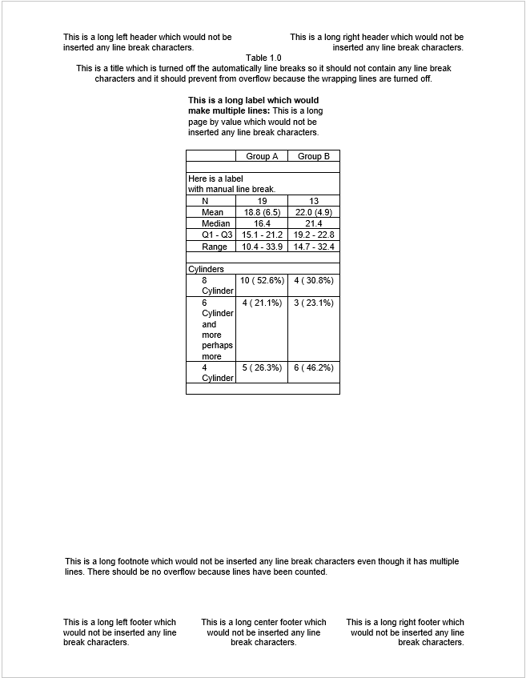

If the user inserts a line break manually using `\n`, it is inserted as expected.  

[top](#top)

Next: [More Examples](reporter-more.html)
