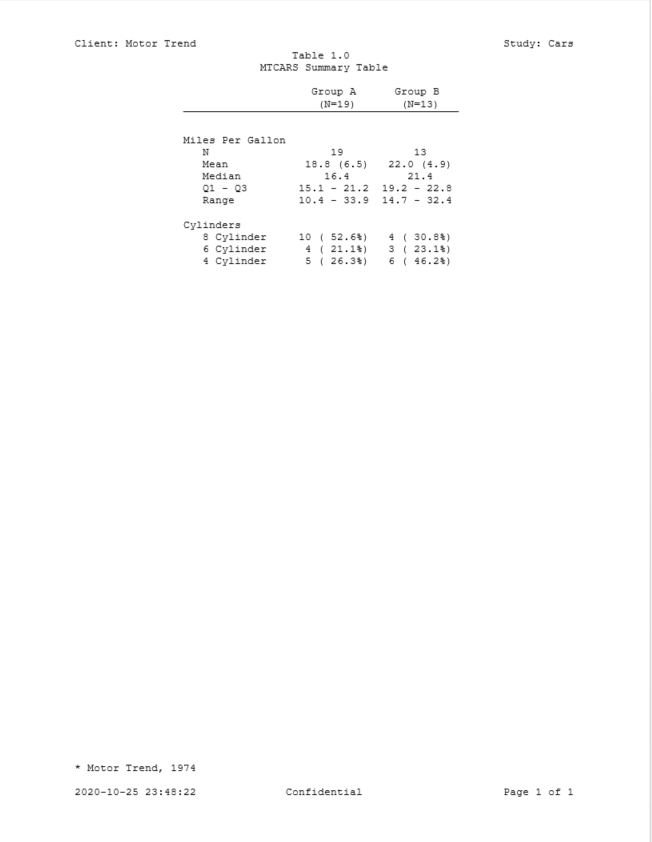

```{r setup, include = FALSE}
knitr::opts_chunk$set(
  collapse = TRUE,
  comment = "#>"
)
```

### Output to RTF, PDF, HTML, and DOCX

The **reporter** package supports five types of output: TXT, RTF, PDF, HTML, 
and DOCX. 
The package produces TXT reports by default.  If you want to produce RTF, PDF, 
HTML, or DOCX output, simply change the output type.  Below is a portion
of the Iris data listing from above, but the `output_type`
is now set to DOCX.

```{r eval=FALSE, echo=TRUE} 
library(reporter)

# Create temporary path
tmp <- file.path(tempdir(), "example9.docx")

# Read in prepared data
df <- iris[1:25, ]

# Create table
tbl <- create_table(df, borders = "bottom") 


# Create report and add content
rpt <- create_report(tmp, output_type = "DOCX", orientation = "portrait", 
                     font = "Times", font_size = 12) %>% 
  set_margins(top = 1, bottom = 1) %>%
  page_header(left = "Client: 1-800-FLOWERS", right = "Study: Iris") %>% 
  titles("Listing 1.0", "Iris Data Listing") %>% 
  add_content(tbl) %>% 
  footnotes("* Bulletin of the American Iris Society, 1935") %>%
  page_footer(left = Sys.time(), 
              center = "Confidential", 
              right = "Page [pg] of [tpg]")

# Write out report
write_report(rpt)

# View report
# file.show(tmp)

```



Next: [Example 10: Fonts and Borders](reporter-fonts.html)
