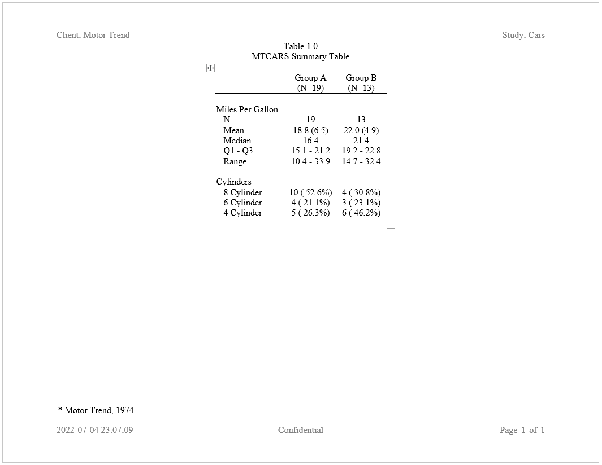

```{r setup, include = FALSE}
knitr::opts_chunk$set(
  collapse = TRUE,
  comment = "#>"
)
```

### Create a Summary Table with Stub Column

Here is an example of the same table of summary statistics,
but with row labels merged into a stub column.  Creation of a stub
column is accomplished by the `stub()` function, which identifies
two or more variables to merge into a single column.  The `label_row`
parameter tells `write_report()` to use that variable as a label row,
and the `indent` parameter nests the second variable value under the first:

```{r eval=FALSE, echo=TRUE} 
library(reporter)

# Create temporary path
tmp <- file.path(tempdir(), "example3.rtf")

# Read in prepared data
df <- read.table(header = TRUE, text = '
      var     label        A             B          
      "ampg"   "N"          "19"          "13"         
      "ampg"   "Mean"       "18.8 (6.5)"  "22.0 (4.9)" 
      "ampg"   "Median"     "16.4"        "21.4"       
      "ampg"   "Q1 - Q3"    "15.1 - 21.2" "19.2 - 22.8"
      "ampg"   "Range"      "10.4 - 33.9" "14.7 - 32.4"
      "cyl"    "8 Cylinder" "10 ( 52.6%)" "4 ( 30.8%)" 
      "cyl"    "6 Cylinder" "4 ( 21.1%)"  "3 ( 23.1%)" 
      "cyl"    "4 Cylinder" "5 ( 26.3%)"  "6 ( 46.2%)"')

# Create table
tbl <- create_table(df, first_row_blank = TRUE) %>% 
  stub(c("var", "label")) %>% 
  define(var, blank_after = TRUE, label_row = TRUE, 
         format = c(ampg = "Miles Per Gallon", cyl = "Cylinders")) %>% 
  define(label, indent = .25) %>% 
  define(A, label = "Group A", align = "center", n = 19) %>% 
  define(B, label = "Group B", align = "center", n = 13)


# Create report and add content
rpt <- create_report(tmp, output_type = "RTF",
                     font = "Times", font_size = 12) %>% 
  page_header(left = "Client: Motor Trend", right = "Study: Cars") %>% 
  titles("Table 1.0", "MTCARS Summary Table") %>% 
  add_content(tbl) %>% 
  footnotes("* Motor Trend, 1974") %>%
  page_footer(left = Sys.time(), 
              center = "Confidential", 
              right = "Page [pg] of [tpg]")

# Write out report
write_report(rpt)

# file.show(tmp)

```


Next: [Example 4: Table and Text](reporter-text.html)
