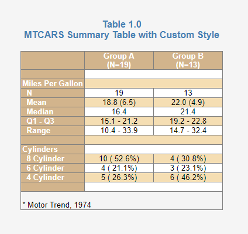
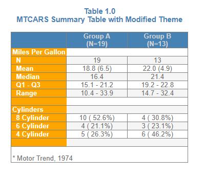
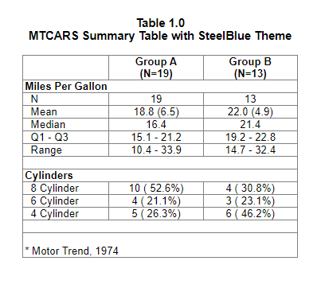
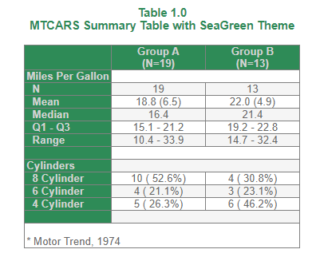
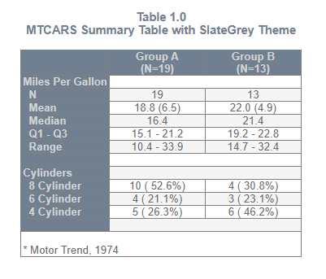
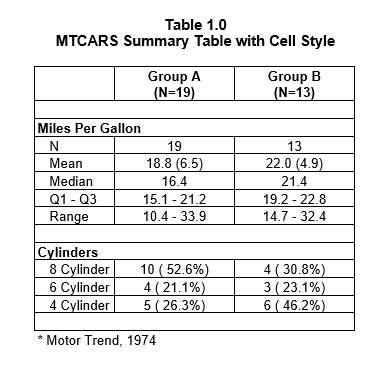

```{r setup, include = FALSE}
knitr::opts_chunk$set(
  collapse = TRUE,
  comment = "#>"
)
```

## Styles and Themes

The **reporter** package now supports styles and themes for HTML reports.
Styling for more output types will be supported in future versions.

## Custom Style
To create a custom style, use the `create_style()` function.  This function
allows you to control colors and bolding for many common elements of a report. 
The `create_style()` function returns a style object, which can then
be passed to the style parameter of the `add_style()` function.  Here 
is an example of a custom style:

```{r eval=FALSE, echo=TRUE} 
library(reporter)

# Create temporary path
tmp <- file.path(tempdir(), "example12a.html")

# Read in prepared data
df <- read.table(header = TRUE, text = '
    var     label        A             B          
    "ampg"   "N"          "19"          "13"         
    "ampg"   "Mean"       "18.8 (6.5)"  "22.0 (4.9)" 
    "ampg"   "Median"     "16.4"        "21.4"       
    "ampg"   "Q1 - Q3"    "15.1 - 21.2" "19.2 - 22.8"
    "ampg"   "Range"      "10.4 - 33.9" "14.7 - 32.4"
    "cyl"    "8 Cylinder" "10 ( 52.6%)" "4 ( 30.8%)" 
    "cyl"    "6 Cylinder" "4 ( 21.1%)"  "3 ( 23.1%)" 
    "cyl"    "4 Cylinder" "5 ( 26.3%)"  "6 ( 46.2%)"')

# Create custom style
sty <- create_style(font_name = "Arial",
                    font_size = 10,
                    background_color = "WhiteSmoke",
                    border_color = "Grey",
                    title_font_size = 12,
                    title_font_bold = TRUE,
                    title_font_color = "SteelBlue",
                    table_header_background = "Tan",
                    table_header_font_bold = TRUE,
                    table_header_font_color = "White",
                    table_body_background = "White",
                    table_body_stripe = "Wheat",
                    table_stub_background = "Tan",
                    table_stub_font_color = "White",
                    table_stub_font_bold = TRUE
                 )

# Create table
tbl <- create_table(df, first_row_blank = TRUE, borders = c("all")) %>% 
  stub(c("var", "label")) %>% 
  column_defaults(width = 1.25) %>% 
  define(var, blank_after = TRUE, label_row = TRUE, 
         format = c(ampg = "Miles Per Gallon", cyl = "Cylinders")) %>% 
  define(label, indent = .25) %>% 
  define(A, label = "Group A", align = "center", n = 19) %>% 
  define(B, label = "Group B", align = "center", n = 13)  %>% 
  titles("Table 1.0", "MTCARS Summary Table with Custom Style", 
         borders = "none") %>% 
  footnotes("* Motor Trend, 1974", borders = "outside")

# Create report and add custom style
rpt <- create_report(tmp, output_type = "HTML", font = "Arial") %>% 
  add_content(tbl) %>% 
  add_style(sty)

# Write out report
write_report(rpt)

# View report
# file.show(tmp)

```


## Themes
A Theme may be applied to a report using the function `add_style()` 
and passing a theme name to the theme parameter.  Currently there are
seven themes available: "MidnightBlue", "SteelBlue", 
"DarkRed", "SeaGreen", "SlateGrey", "Plain", and "SASDefault".  Here is 
an example using a named theme:

```{r eval=FALSE, echo=TRUE} 
library(reporter)

# Create temporary path
tmp <- file.path(tempdir(), "example12b.html")

# Read in prepared data
df <- read.table(header = TRUE, text = '
      var     label        A             B          
      "ampg"   "N"          "19"          "13"         
      "ampg"   "Mean"       "18.8 (6.5)"  "22.0 (4.9)" 
      "ampg"   "Median"     "16.4"        "21.4"       
      "ampg"   "Q1 - Q3"    "15.1 - 21.2" "19.2 - 22.8"
      "ampg"   "Range"      "10.4 - 33.9" "14.7 - 32.4"
      "cyl"    "8 Cylinder" "10 ( 52.6%)" "4 ( 30.8%)" 
      "cyl"    "6 Cylinder" "4 ( 21.1%)"  "3 ( 23.1%)" 
      "cyl"    "4 Cylinder" "5 ( 26.3%)"  "6 ( 46.2%)"')

# Create table
tbl <- create_table(df, first_row_blank = FALSE, borders = "all") %>% 
  stub(c("var", "label")) %>% 
  column_defaults(width = 1.25) %>% 
  define(var, blank_after = TRUE, label_row = TRUE, 
         format = c(ampg = "Miles Per Gallon", cyl = "Cylinders")) %>% 
  define(label, indent = .25) %>% 
  define(A, label = "Group A", align = "center", n = 19) %>% 
  define(B, label = "Group B", align = "center", n = 13)  %>% 
  titles("Table 1.0", "MTCARS Summary Table with SteelBlue Theme", 
         borders = "none") %>% 
  footnotes("* Motor Trend, 1974", borders = "outside")

# Create report and add theme
rpt <- create_report(tmp, output_type = "HTML", font = "Arial", 
                     font_size = 12) %>% 
  set_margins(top = 1, bottom = 1) %>%
  add_content(tbl) %>% 
  add_style(theme = "SteelBlue")

# Write out report
write_report(rpt)

# View report
# file.show(tmp)

```


## View/Modify a Theme
Sometimes you may want to look at or modify an existing theme.  The function
`get_theme()` allows you to do this.  Simply pass the theme name to 
`get_theme()` and it will return the theme as a style object.  From there you 
can print the style object to see how it was defined.  You can also
modify it to suit your own preferences.  Here is an example of how to 
view and modify a theme.

```{r eval=FALSE, echo=TRUE} 
library(reporter)
library(magrittr)

tm <- get_theme("SteelBlue")

print(tm)
# # A style specification: 
# - font_name: 'Arial'
# - font_size: 10
# - text_color: 'DimGrey'
# - title_font_size: 11
# - title_font_bold: TRUE
# - title_font_color: 'SteelBlue'
# - border_color: 'Grey'
# - table_header_background: 'SteelBlue'
# - table_header_font_bold: TRUE
# - table_header_font_color: 'LightGrey'
# - table_body_background: 'White'
# - table_body_stripe: 'WhiteSmoke'
# - table_stub_background: 'SteelBlue'
# - table_stub_font_color: 'LightGrey'
# - table_stub_font_bold: TRUE

# Modify theme
tm$table_stub_background <- "Orange"
tm$table_stub_font_color <- "White"

# Create temporary path
tmp <- file.path(tempdir(), "example12c.html")

# Read in prepared data
df <- read.table(header = TRUE, text = '
      var     label        A             B          
      "ampg"   "N"          "19"          "13"         
      "ampg"   "Mean"       "18.8 (6.5)"  "22.0 (4.9)" 
      "ampg"   "Median"     "16.4"        "21.4"       
      "ampg"   "Q1 - Q3"    "15.1 - 21.2" "19.2 - 22.8"
      "ampg"   "Range"      "10.4 - 33.9" "14.7 - 32.4"
      "cyl"    "8 Cylinder" "10 ( 52.6%)" "4 ( 30.8%)" 
      "cyl"    "6 Cylinder" "4 ( 21.1%)"  "3 ( 23.1%)" 
      "cyl"    "4 Cylinder" "5 ( 26.3%)"  "6 ( 46.2%)"')

# Create table
tbl <- create_table(df, first_row_blank = FALSE, borders = "all") %>% 
  stub(c("var", "label")) %>% 
  column_defaults(width = 1.25) %>% 
  define(var, blank_after = TRUE, label_row = TRUE, 
         format = c(ampg = "Miles Per Gallon", cyl = "Cylinders")) %>% 
  define(label, indent = .25) %>% 
  define(A, label = "Group A", align = "center", n = 19) %>% 
  define(B, label = "Group B", align = "center", n = 13)  %>% 
  titles("Table 1.0", "MTCARS Summary Table with Modified Theme", 
         borders = "none") %>% 
  footnotes("* Motor Trend, 1974", borders = "outside")

# Create report and add modified theme
rpt <- create_report(tmp, output_type = "HTML", font = "Arial", 
                     font_size = 12) %>% 
  set_margins(top = 1, bottom = 1) %>%
  add_content(tbl) %>% 
  add_style(style = tm)

# Write out report
write_report(rpt)

# View report
# file.show(tmp)


```


#### Theme Gallery
In addition to the SteelBlue theme shown above, there are six more themes.
Here is a sample of each:









## Cell Styles

To modify styles for a particular cell in a table, use the `cell_style()`
object.  The `cell_style()` object can be passed into the style parameter on
the `define()`, `stub()`, or `column_defaults()` functions.  This object has 
parameters to set available style settings, and an indicator parameter to 
specify which rows to apply the style to.  The indicator can be one
of four values:

* **labelrow**: Applies the style to all label rows.
* **blankrow**: Applies the style to all blank rows.
* **datarow**: Applies the style to all rows that are not label rows or blank rows.
* **[variable name]**: Applies the style to all rows that have a TRUE value
in a specified variable on the incoming dataset.

First let's look at an example to set the label rows bold:
```{r eval=FALSE, echo=TRUE} 
library(reporter)

# Create temporary path
tmp <- file.path(tempdir(), "example12j.rtf")

# Read in prepared data
df <- read.table(header = TRUE, text = '
    var     label        A             B          
    "ampg"   "N"          "19"          "13"         
    "ampg"   "Mean"       "18.8 (6.5)"  "22.0 (4.9)" 
    "ampg"   "Median"     "16.4"        "21.4"       
    "ampg"   "Q1 - Q3"    "15.1 - 21.2" "19.2 - 22.8"
    "ampg"   "Range"      "10.4 - 33.9" "14.7 - 32.4"
    "cyl"    "8 Cylinder" "10 ( 52.6%)" "4 ( 30.8%)" 
    "cyl"    "6 Cylinder" "4 ( 21.1%)"  "3 ( 23.1%)" 
    "cyl"    "4 Cylinder" "5 ( 26.3%)"  "6 ( 46.2%)"')


# Create table
tbl <- create_table(df, first_row_blank = TRUE, borders = c("all"), 
                    header_bold = TRUE) %>% 
  stub(c("var", "label"), 
       style = cell_style(bold = TRUE, indicator = "labelrow")) %>% 
  column_defaults(width = 1.25) %>% 
  define(var, blank_after = TRUE, label_row = TRUE, 
         format = c(ampg = "Miles Per Gallon", cyl = "Cylinders")) %>% 
  define(label, indent = .25) %>% 
  define(A, label = "Group A", align = "center", n = 19) %>% 
  define(B, label = "Group B", align = "center", n = 13)  %>% 
  titles("Table 1.0", "MTCARS Summary Table with Cell Style", 
         borders = "none", bold = TRUE, font_size = 11) %>% 
  footnotes("* Motor Trend, 1974", borders = "none", blank_row = "none")

# Create report and add custom style
rpt <- create_report(tmp, output_type = "RTF", font = "Arial") %>% 
  add_content(tbl) 

# Write out report
write_report(rpt)

# View report
# file.show(tmp)

```


When a variable name is passed as the indicator value, this variable should 
exist on the input dataset.  The indicator column should have TRUE or FALSE
values for each row where you want the style applied.  This feature gives you
complete control over cell styling.  

Now let's look at and example of setting a style on a variable based on the
variable value:
```{r eval=FALSE, echo=TRUE} 
library(reporter)

# Create temporary path
tmp <- file.path(tempdir(), "example12k.rtf")

# Prepare data
df <- data.frame(names = rownames(mtcars), mtcars[, 1:3])

# Set style indicator variable
df$mpgind <- ifelse(df$mpg > 20, TRUE, FALSE)

# Create table
tbl <- create_table(df, first_row_blank = TRUE, 
                    header_bold = TRUE, borders = c("top", "bottom")) %>% 
  define(names, label = "Car Name") %>%
  define(mpg, label = "Miles Per Gallon", 
         style = cell_style(bold = TRUE, indicator = "mpgind")) %>% 
  define(cyl, label = "Cylinders") %>% 
  define(disp, label = "Displacement")  %>% 
  define(mpgind, visible = FALSE) %>%
  titles("Table 1.0", "MTCARS with Indicator Variable", 
         borders = "none", bold = TRUE, font_size = 11) %>% 
  footnotes("* Motor Trend, 1974", borders = "none", blank_row = "none")

# Create report and add custom style
rpt <- create_report(tmp, output_type = "RTF", font = "Arial") %>% 
  add_content(tbl) 

# Write out report
write_report(rpt)

# View report
# file.show(tmp)

```


Note that cell styling is available for all output types except TXT.
Also note that the `cell_style()` object currently only supports "bold" styling.
More styling options will be added in future releases of **reporter**.


Next: [Example 13: Superscripts and Subscripts](reporter-super.html)
