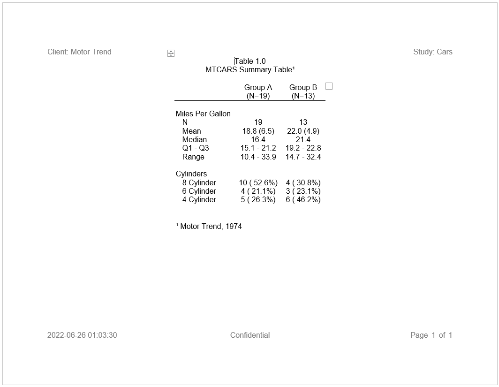

```{r setup, include = FALSE}
knitr::opts_chunk$set(
  collapse = TRUE,
  comment = "#>"
)
```

### Adding Superscripts, Subscripts, and Symbols to a Report

It is very common to include superscripts, subscripts, and special symbols 
on a statistical report. The **reporter** package 
supports such features. You may add superscripts and subscripts
to your titles, footnotes, page header, page footer, and labels for your
column headers and spanning headers.  You can add them using a curly brace 
delimiter and some useful functions from the **common** package.  The **common**
package is loaded automatically with **reporter**.  Here is an example:

```{r eval=FALSE, echo=TRUE} 
library(reporter)
library(magrittr)

# Create temp file path
tmp <- file.path(tempdir(), "example13.rtf")

# Prepare Data
dat <- airquality[sample(1:153, 15), ]
dat$Month <-  as.Date(paste0("1973-", dat$Month, "-01"))

# Define table
tbl <- create_table(dat, show_cols = c("Month", "Day", "Wind", 
                                       "Temp", "Ozone")) %>%
  titles("Table 9.6", "Air Quality Sample Report{supsc('1')}",   # Superscript 1
         borders = c("top", "bottom"), blank_row = "none") %>%
  column_defaults(width = .7) %>%
  define(Month, format = "%B", align = "left", width = 1) %>%
  define(Temp, format = "%.0f") %>%
  footnotes("{supsc('1')}New York, May to September 1973",       # Superscript 1
            borders = c("top", "bottom"), blank_row = "none") 

# Define report
rpt <- create_report(tmp, output_type = "RTF", font = "Arial", 
                     font_size = 12, missing = "-") %>%
  page_header("Sponsor: EPA", "Study: B34958", blank_row = "below") %>% 
  add_content(tbl) %>% 
  page_footer(Sys.Date(), right = "Page [pg] of [tpg]")

# Write the report to the file system
write_report(rpt)

# View report
# file.show(tmp)

```



### Superscript and Subscript Functions

The `supsc()` function shown above is a superscript function. This function
will translate a normal character into a superscript character.  It
works by looking up a UTF-8 superscript character based on the passed parameter
string.  The function will attempt to translate each character into a UTF-8 
superscript equivalent.  All numbers and most Latin letters are available
in a superscript version.

The **common** package includes two more useful functions: `subsc()` and `symbol()`.
The `subsc()` function is similar to the superscript function, except it looks
up UTF-8 subscript characters. While UTF-8 subscript characters are more limited
than the superscripts, the function will translate all numbers appropriately.

Note that the `supsc()` and `subsc()` functions will translate the entire string.
Translating the entire string means multiple characters can be combined
to create complex superscript or subscript expressions.  Here is an
example of such an expression:

```{r eval=FALSE, echo=TRUE} 

# Create complex superscript expression
ex1 <- "x" %p% supsc("(n+4)")

# View expression
ex1
# [1] "x⁽ⁿ⁺⁴⁾"

```
### Symbol Function

Finally, the `symbol()` function will look up UTF-8 symbols.  The function
uses HTML style keywords to identify the symbol to look up.  The function 
supports keywords for trademarks, currencies, mathematical symbols, 
logical symbols, Greek letters, and more. Here are a few 
examples:


### Superscripts and Subscripts in Table Cells

To get superscripts or subscripts into table cells, they must
be added to the table data prior to reporting.  Simply use the standard R 
subset operators 
to append the subscript or superscript to the desired cell value.

Here is an example appending the superscript "two" into a cell in the second 
row, column "A", using the MTCARS data frame from the previous example:

```{r eval=FALSE, echo=TRUE} 

# Append superscript using paste0()
df[2, "A"] <- df[2, "A"] %p% supsc('2')

# View data frame
df
#    var      label           A           B
# 1 ampg          N          19          13
# 2 ampg       Mean 18.8 (6.5)²  22.0 (4.9)  # Observe superscript in column A
# 3 ampg     Median        16.4        21.4
# 4 ampg    Q1 - Q3 15.1 - 21.2 19.2 - 22.8
# 5 ampg      Range 10.4 - 33.9 14.7 - 32.4
# 6  cyl 8 Cylinder 10 ( 52.6%)  4 ( 30.8%)
# 7  cyl 6 Cylinder  4 ( 21.1%)  3 ( 23.1%)
# 8  cyl 4 Cylinder  5 ( 26.3%)  6 ( 46.2%)

```

### Additional Unicode Characters

The functions from the common package make it easy to add superscripts, 
subscripts, and many symbols to your reports.  However, these functions
do not include all possible special characters. If you need more characters, 
you may add any UTF-8 character to a report using the Unicode escape "\\U".
For example, the Unicode character for a superscript one (1) is "\\U00B9".
There are millions of Unicode characters.
These codes may be discovered via an internet search, and can be embedded
in any string.

### Output Type Limitations

The Unicode characters will work on all output types, with
one exception.  The PDF output type only supports superscripts for the numbers
one, two, and three, and a few other special characters. 
PDF will render unsupported characters
as a question mark.  If you need to output an unsupported character
with the PDF output type, it is recommended that you use parenthesis () or 
the carrot ^ character to signify a superscript or subscript, or use a another
supported symbol from the ASCII character set.


Next: [Page Break](reporter-break.html)
