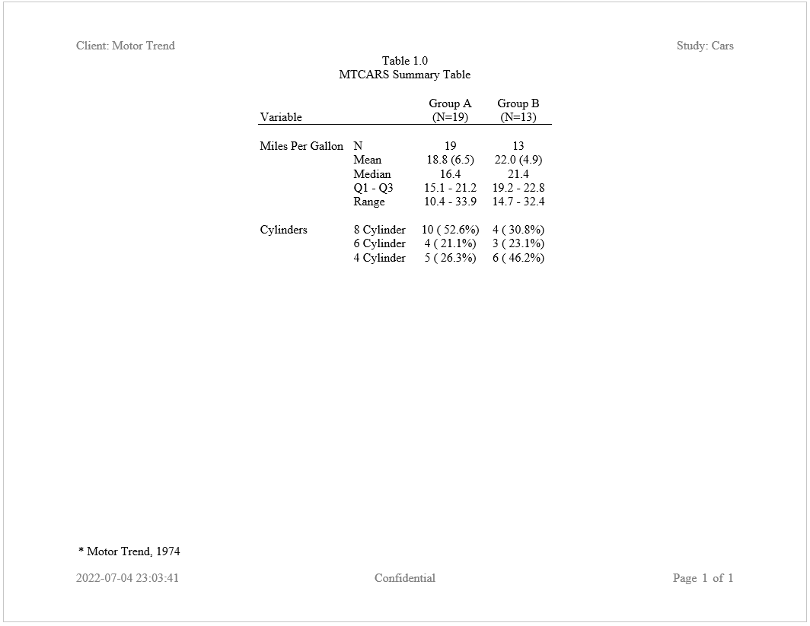

```{r setup, include = FALSE}
knitr::opts_chunk$set(
  collapse = TRUE,
  comment = "#>"
)
```

### Create a Summary Table

Here is an example of a regulatory-style table of summary statistics. This
example also introduces the `define()` function on `create_table()`.  The
`define()` function allows you to control many aspects of a column, including
the label, format, width, alignment, and much more:

```{r eval=FALSE, echo=TRUE} 
library(reporter)

# Create temporary path
tmp <- file.path(tempdir(), "example2.rtf")

# Read in prepared data
df <- read.table(header = TRUE, text = '
      var     label        A             B          
      "ampg"   "N"          "19"          "13"         
      "ampg"   "Mean"       "18.8 (6.5)"  "22.0 (4.9)" 
      "ampg"   "Median"     "16.4"        "21.4"       
      "ampg"   "Q1 - Q3"    "15.1 - 21.2" "19.2 - 22.8"
      "ampg"   "Range"      "10.4 - 33.9" "14.7 - 32.4"
      "cyl"    "8 Cylinder" "10 ( 52.6%)" "4 ( 30.8%)" 
      "cyl"    "6 Cylinder" "4 ( 21.1%)"  "3 ( 23.1%)" 
      "cyl"    "4 Cylinder" "5 ( 26.3%)"  "6 ( 46.2%)"')

# Create table
tbl <- create_table(df, first_row_blank = TRUE) %>% 
  define(var, label = "Variable", blank_after = TRUE, dedupe = TRUE,
         format = c(ampg = "Miles Per Gallon", cyl = "Cylinders")) %>% 
  define(label, label = "") %>% 
  define(A, label = "Group A", align = "center", n = 19) %>% 
  define(B, label = "Group B", align = "center", n = 13)


# Create report and add content
rpt <- create_report(tmp, output_type = "RTF", 
                     font = "Times", font_size = 12) %>% 
  page_header(left = "Client: Motor Trend", right = "Study: Cars") %>% 
  titles("Table 1.0", "MTCARS Summary Table") %>% 
  add_content(tbl) %>% 
  footnotes("* Motor Trend, 1974") %>%
  page_footer(left = Sys.time(), 
              center = "Confidential", 
              right = "Page [pg] of [tpg]")

# Write out report
write_report(rpt)

# file.show(tmp)

```


Next: [Example 3: Table Stub](reporter-stub.html)
