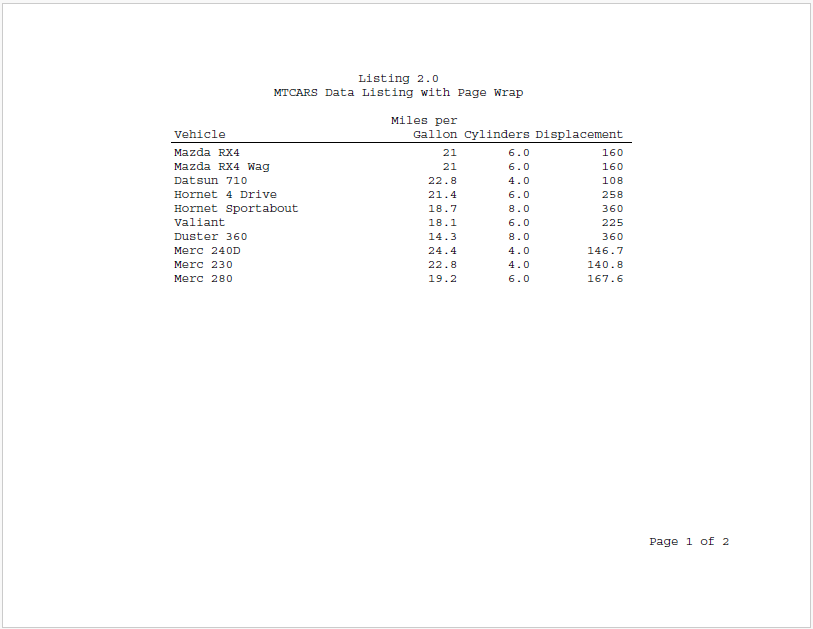

```{r setup, include = FALSE}
knitr::opts_chunk$set(
  collapse = TRUE,
  comment = "#>"
)
```

### Handle Wide Tables with Page Wrap

Page wrapping will occur 
automatically if the table width exceeds the available page width.  But 
page wrapping can also be controlled using the `page_wrap` parameter on the 
`define()` function.  Below is an example.  Also note the use of the `id_var` 
option to cause the vehicle column to be retained on each wrapped page. 

```{r eval=FALSE, echo=TRUE}  
library(reporter)

# Create temp file name
tmp <- file.path(tempdir(), "example6.pdf")

# Prepare data
dat <- mtcars[1:10, ]
dat <- data.frame(vehicle = rownames(dat), dat)

# Define table
tbl <- create_table(dat, show_cols = 1:8) %>% 
  define(vehicle, label = "Vehicle", width = 3, id_var = TRUE, align = "left") %>% 
  define(mpg, label = "Miles per Gallon", width = 1) %>% 
  define(cyl, label = "Cylinders", format = "%.1f") %>% 
  define(disp, label = "Displacement") %>% 
  define(hp, label = "Horsepower", page_wrap = TRUE) %>% 
  define(drat, visible = FALSE) %>% 
  define(wt, label = "Weight") %>% 
  define(qsec, label = "Quarter Mile Time", width = 1.5) 

  
# Create the report
rpt <- create_report(tmp, output_type = "PDF", 
                     font = "Courier", font_size = 12) %>% 
  titles("Listing 2.0", "MTCARS Data Listing with Page Wrap") %>% 
  set_margins(top = 1, bottom = 1) %>% 
  add_content(tbl) %>% 
  page_footer(right = "Page [pg] of [tpg]")

# Write the report
write_report(rpt)

# file.show(tmp)

```



Next: [Example 7: Page By](reporter-pageby.html)
