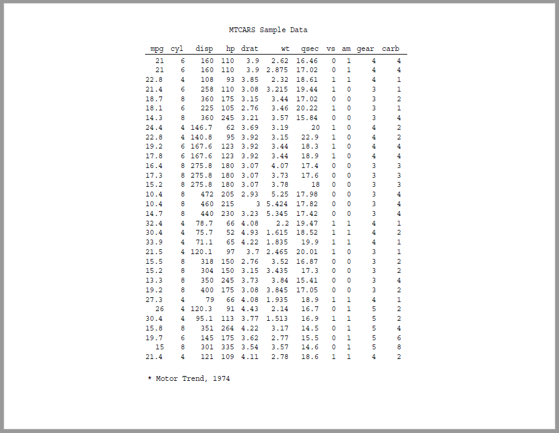

```{r, include = FALSE}
knitr::opts_chunk$set(
  collapse = TRUE,
  comment = "#>"
)
```

The **reporter** package creates regulatory-style statistical reports. It was designed
to produce Tables, Listings, and Figures (TLFs) for the 
the pharmaceutical, biotechnology, and medical-device industries.
However, the functions are generalized enough to provide statistical reporting
for any industry.  The package is written in Base R, and has no dependencies on
any other reporting package.

The package is intended to give R programmers flexible 
report layout capabilities 
and a choice of output formats. The package will 
initially focus on printable, file-based 
output formats. 
The current version supports TXT, RTF, PDF, HTML, and DOCX output types. Note that, 
unlike other packages, all outputs from the **reporter** package
are paged by default.  

The **reporter** package is distributed under a [Creative Commons non-commercial 
license](https://creativecommons.org/licenses/by-nc/4.0).  It is freely available 
for personal and organizational use, but cannot be used to create a commercial 
product without permission of the license holder.

## Key Features

The **reporter** package contains the following key features:

* Titles, footnotes, page header, and page footer are repeated on each page
* Supports header labels and spanning headers 
* Calculates default columns widths automatically
* Includes automatic wrapping and splitting of wide and long tables
* Integrates with the **fmtr** package to format numeric, date, and character data
* Plots from the popular **ggplot2** package can be added to RTF, PDF, HTML, 
and DOCX reports
* Allows appending multiple tables to a report, multiple tables to a page, 
and intermingling of text, tables, and plots
* Supports in-report date/time stamps and "Page X of Y" page numbering


## How to use **reporter**
There are four steps to creating a report:

* Create report content
* Create report 
* Add content to the report
* Write out the report 

You can create the report with the `create_report()` function.  Content is
created with the `create_table()`, `create_text()`, or `create_plot()`
functions.  Add content to the report with the `add_content()` function. 
Finally, the report can be written to a file with the `write_report()` function.  

Let's look at a simple example:
```{r eval=FALSE, echo=TRUE}
library(reporter)
library(magrittr)

# Create temp file name 
tmp <- file.path(tempdir(), "example.pdf")

# Create report content
tbl <- create_table(mtcars) %>% 
  titles("MTCARS Sample Data") %>% 
  footnotes("* Motor Trend, 1974")

# Create report and add content  
rpt <- create_report(tmp, output_type = "PDF", 
                     font = "Courier", font_size = 12) %>% 
  add_content(tbl)
  
# Write out the report
write_report(rpt)

# Un-comment to view report
# file.show(tmp)
```


As you can see, using the **reporter** package, you can 
create a useful report with just a few lines of code.  By default, 
the package creates a text report.  But you can create reports in 
RTF, PDF, HTML, and DOCX with just a single parameter change.  

Besides the functions shown above, there are additional functions to create
page headers and footers, spanning headers, a report stub, a by-variable, 
and more.  The package also allows you to add text and plots to a report.
All of these capabilities are demonstrated in the examples below.

## Next Steps

For next steps, it is recommended that you 
review some examples of the **reporter** package in action.  The examples
show a variety of common use cases.  You will see
that the **reporter** functions are very intuitive and easy to use.  Here is a 
list of examples:

* [Example 1: Listing](reporter-listing.html)
* [Example 2: Table](reporter-table.html)
* [Example 3: Table Stub](reporter-stub.html) 
* [Example 4: Table and Text](reporter-text.html)
* [Example 5: Spanning Headers](reporter-spanning.html)
* [Example 6: Page Wrap](reporter-wrap.html)
* [Example 7: Page By](reporter-pageby.html)
* [Example 8: Title Header](reporter-title_header.html)
* [Example 9: RTF, PDF, HTML, and DOCX](reporter-rtf.html)
* [Complete Example 1: Listing](reporter-example1.html)
* [Complete Example 2: Demographics](reporter-example2.html)
* [Complete Example 3: Adverse Events](reporter-example3.html)
* [Complete Example 4: Figure](reporter-example4.html)
* [Complete Example 5: Survival Analysis](reporter-example5.html)


